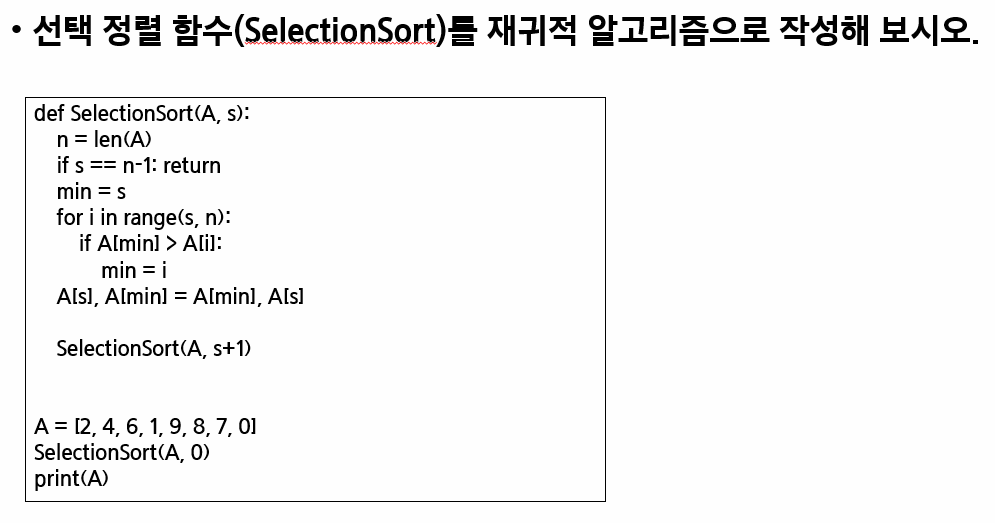

# �����˻�/�׸���


| Title       | Directory       | ��� |
| ----------- | --------------- | ---- |
| ��������1   | `p1`            | ppt  |
| ��������2   | `p2`            | ppt  |
| 5188_�ּ��� | `5188_�ּ���`   | HW   |

### �������� 1




### �������� 2


```sh
# input.txt
4
124783
667767
054060
101123
```

```sh
# output
False
True
True
False
```


### [HomeWork.5188_�ּ���](https://swexpertacademy.com/main/learn/course/lectureProblemViewer.do)

### **Extra**

- `1244_�ִ���`
