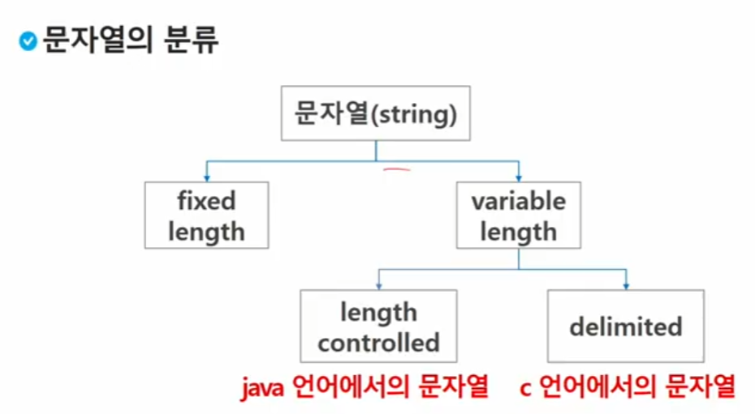

# 알고리즘


### 정렬

* 일정한 자료형의 변수들을 하나의 이름으로 열거하여 사용하는 자료구조
* 아래의 예는 6개의 변수를 사용


### 정렬

* 2개 이상의 자료를 특정 기준에 의해 작은 값부터 큰 값, 혹은 그 반대의 순서대로 재배열하는 것
* `key`: 자료를 정렬하는 기준이 되는 특정 값

* 버블 정렬(Bubble Sort) O(n^2)
  * 인접한 두 개의 원소를 비교하며 자리를 계속 교환하는 방식
  * 첫 번째 원소부터 인접한 원소끼리 계속 자리를 교환하면서 맨 마지막 자리까지 이동한다.
  * 한단계가 끝나면 가장 큰 원소가 마지막 자리로 정렬된다.
  * 교환하며 자리를 이동하는 모습이 물위에 올라오는 거품 모양과 같아고 하여 버블 정렬이라고 한다.


* 카운팅 정렬(Counting Sort) O(N)


### 순열(Permutation)

* 서로 다른 것들 중 몇 개를 뽑아서 한 줄로 나열하는 것
* 서로 다른 n개 중 r개를 택하는 순열은 아래와 같이 표현한다. `nPr`
* 그리고 nPr은 다음과 같은 식이 성립한다. `nPr` = `n!/(n-r)!`
* `nPn` = n! Factorial


포함하는 모든 순열을 생성하는 함수 

```python
for i1 in range(1, 4):
    for i 2 in range(1, 4):
        if i2 != i1:
            for i3 in range(1, 4):
                if i3!=i1 and i3 != i2:
                    print(i1, i2, i3)
```


### 그리디(탐욕) 알고리즘

* 탐욕 알고리즘은 최적해를 구하는 데 사용되는 근시안적인 방법

* 여러 경우 중 하나를 결정해야 할 때 마다 그 순간에 최적이라고 생각되는 것을 선택해 나가는 방식으로 진행하여 최종적인 해답에 도달한다.

* 각 선택의 시점에서 이루어지는 결정은 지역적으로는 최적이지만 그 선택들을 계속 수집하여 최종적인 해답을 만들었다고 하여, 그것이 최적이라는 보장은 없다.

* 일반적으로, 머릿속에 떠오르는 생각을 검증없이 구현하면 Greedy접근이 된다.

  

ex) 어떻게 하면 손님에게 거스름돈으로 주는 지폐와 동전의 개수를 최소한으로 줄일 수 있을까?

1. 해선택: 단위가 큰 동전으로만 거스름돈을 만들면 동전의 개수가 줄어든다.
2. 실행 가능성 검사: 액수를 초과 하는 지 확인한다. 초과한다면 마지막에 추가한 동전을 거스름돈에서 빼고 1)로 돌아가서 한단계 작은 단위의 동전을 추가하낟.
3. 해 검사 : 일치하면 멈춘다. 


### 탐욕알고리즘 Baby-gin 풀이

* 6개의 숫자는 6자리의 정수 값으로 입력된다.
* counts 배열의 각 원소를 체크하여 run과 triplet 및 baby-gin 여부를 확인한다.


### 검색

* 저장되어 있는 자료 중에서 원하는 항목을 찾는 작업
* 목적하는 탐색키를 가진 항목을 찾는 것
  * 탐색키 : 자료를 구별하여 인식 할 수 있는 키
* 검색의 종류
  * 순차 검색(Sequential search)
  * 이진 검색(Binary Search)
  * 해쉬 (Hash)

### 순차 검색 (Sequential Search)

* 일렬로 되어 있는 자료를 순서대로 검색하는 방법

  * 가장 간단하고 직관적인 검색방법
  * 알고리즘 단순하여 구현 쉽지만 검색 대상의 수가 많은 경우에 수행시간이 급격히 증가

* 2가지 경우

  * 정렬되어 있지 않은 경우
  * 정렬되어 있는 경우

* 검색 과정

  * 첫번째 원소부터 순서대로 검색 대상과 키 값이 같은 원소가 있는지 비교하며 찾는다.

  * 키값이 동일한 원소를 찾으면 그 원소의 인덱스를 반환한다.

  * 자료 끝까지 못찾으면 검색 실패

    

* 구현 예 ==> 인덱스부터 검사해야 한다. 그렇지 않으면 내용을 확인하다가 인덱스 에러 발생 가능

* 정렬이 되어 있지 않을 때, 

  * 찾고자 하는 원소의 순서에 따라 비교 회수가 결정됨
  * 시간 복잡도: O(n)

* 정렬이 되어 있는 경우

  * 자료를 순차적으로 검색하면서 키값을 비교하여 원소의 키값이 검색대상의 키 값보다 크면 찾는 원소가 없다는 뜻  => 더이상 검색 x

  * 시간 복잡도: O(n)


## String

#### 컴퓨터에서의 문자 표현

* 비트를 사용해서 표현 6비트로 영어 대소문자 표현 가능
* 네트워크가 발전하면서 표준화 시킴 
  * ` ASCII 코드`: 문자 인코딩 표준
    * 7bit 인코딩으로 128문자를 표현하여 33개의 제어문자, 95개의 출력 문자 
  * `확장 ASCII` : 표준 문자 이외의 부가적인 문자를 128개 추가
    * 8bit => 128개의 문자는 커스터마이징 가능하다.

* 오늘날 대부분의 컴퓨터는 문자를 읽고 쓰는데 ASCII형식을 사용한다.
* 하지만 각 나라에서 자국 문자 표현의 필요성을 위해 코드체계를 만들어서 사용하게 되었다.
  * 조합형 : 가능한 모든 조합 만듬
  * 완성형 : 주로 사용하는 것만
  * 하지만 이는 정보 해석의 오류를 발생시킴

* `UNICODE`: 다국어 처리를 위해 표준화 

  * 유니코드도 다시 CharacterSet으로 분류된다.
    * UCS-2 UCS-4

  * 따라서 적당한 외부 인코딩이 필요
    * big-endian, little-endian: 메모리 주소 할당 방법

* 유니코드 인코딩

  * UTF-8 (in web)
    * 뒤의 숫자는 최소크기를 의미함 8bit
  * UTF-16 (in windows, java)
  * UTF-32 (in unix (linux의 조상))

* 파이썬 인코딩

  * 2.x버전 - ASCII -> #-*-coding: utf-8-\*-

  * 3.x버전 - 생략가능


#### 문자열의 분류




#### C언어에서 문자열 처리

* 문자열은 문자들의 배열 형태로 구현된 응용 자료형
* 문자 배열에 문자열을 저장할 때는 항상 마지막에 끝을 표시하는 널문자('\0')를 넣어줘야한다.
* 문자열 처리에 필요한 연산을 함수 형태로 제공한다.

#### 문자열 비교

* equals (Java)
* 문자열 비교에서 ==연산은 메모리 참조가 같은지를 묻는 것

* ==와 is (Python)
  * `==`: 같은 내용이 같으면 True반환
  * `is` : 메모리 주소값이 같으면 True반환


#### 패턴 매칭에 사용되는 알고리즘들

* 고지식한 패턴 검색 알고리즘
* 카프-라빈 알고리즘
* KMP 알고리즘
* 보이어-무어 알고리즘


#### 고지식한 패턴 알고리즘 (Brute Force)

* 본문 문자열을 처음부터 끝까지 차례대로 순회하면서 패턴 내의 문자들을 일일히 비교하는 방식으로 동작

* 최악의 경우 시간 복잡도: O(MN)

#### KMP 알고리즘

* 불일치가 발생한 텍스트 스트링의 앞 부분에 어떤 문자가 있는지를 미리 알고 있으므로, 불일치가 발생한 앞부분에 대하여 다시 비교하지 않고 매칭을 수행
* 패턴을 전처리 하여 배열 next[M]을 구해서 잘못된 시작을 최소화함
  * 불일치가 발생했을 경우 이동할 다음 위치
* 시간 복잡도: O(M+N)
* 텍스트에서 abcdabc까지는 매치되고, e에서 실패한 상황 패턴의 맨앞의 abc와 실패 직전의 abc는 동일함을 이용할 수 있다.


#### 보이어 무어 알고리즘

* 앞의 두 매칭 알고리즘들의 공통점 텍스트 문자열의 문자를 적어도 한번씩 훑는다는 것이다. 따라서 최선의 경우에도 O(n)

* 보이어 무어 알고리즘은 텍스트 문자를 다 보지 않아도 된다.

* 발상의 전환: 패턴의 오른쪽부터 비교한다

  

#### 문자열 탐색 알고리즘 비교


#### 문자열 암호화

* 시저 암호
* 순서대로 평행이동  1을 key값이라고 한다. 
* 문자 변환표


* 단일 치환 암호의 복호화 
  * 모든 키의 조합이 필요하다.
  * 26!개
* bit열의 암호화
  * 배타적 논리합(exclusive-or) 연산 사용