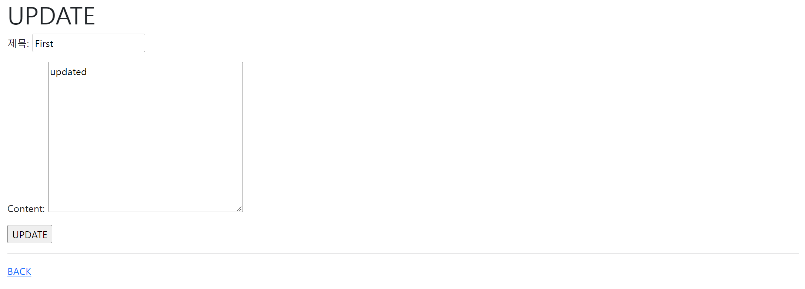

# Workshop




* urls.py

  ```python
  from django.contrib import admin
  from django.urls import path, include
  
  urlpatterns = [
      path('admin/', admin.site.urls),
      path('articles/', include('articles.urls'))
  ]
  ```

  

* aritlces > urls.py

  ```python
  from django.urls import path
  from . import views
  app_name = 'articles'
  
  urlpatterns = [
      path('', views.index, name='index'),
      path('create/', views.create, name='create'),
      path('<int:articleId>/', views.detail, name='detail'),
      path('<int:articleId>/update', views.update, name='update'),
      path('<int:articleId>/delete', views.delete, name='delete'),
  ]
  ```


* views.py

  ```python
  from django.shortcuts import render, redirect
  from .models import Article
  from .forms import ArticleForm
  
  # Create your views here.
  def index(request):
      articles = Article.objects.all()
      context = {
          'articles': articles
      }
      return render(request, 'articles/index.html', context)
  
  
  def create(request):
      if request.method == "POST":
          form = ArticleForm(request.POST)
          if form.is_valid:
              article = form.save()
              return redirect('articles:detail', article.pk)
      else:
          form  = ArticleForm()
      context = {
          'form': form
      }
      return render(request, 'articles/create.html', context)
  
  def detail(request, articleId):
      article = Article.objects.get(id=articleId)
  
      context = {
          'article': article
      }
      return render(request, 'articles/detail.html', context)
  
  def update(request, articleId):
      article = Article.objects.get(id=articleId)
      if request.method == "POST":
          form = ArticleForm(request.POST, instance=article)
          if form.is_valid():
              article = form.save()
              return redirect('articles:detail', article.pk)
      else:
          form = ArticleForm(instance=article)
      context = {
          'article': article, 
          'form': form
      }
      return render(request, 'articles/update.html', context)
  
  def delete(request, articleId):
      if request.method == "POST":
          article = Article.objects.get(id=articleId)
          article.delete()
  
      return redirect('articles:index')
  ```

  

* templates > base.html

  ```html
  <!DOCTYPE html>
  <html lang="en">
  <head>
    <meta charset="UTF-8">
    <meta http-equiv="X-UA-Compatible" content="IE=edge">
    <meta name="viewport" content="width=device-width, initial-scale=1.0">
    <link href="https://cdn.jsdelivr.net/npm/bootstrap@5.1.3/dist/css/bootstrap.min.css" rel="stylesheet" integrity="sha384-1BmE4kWBq78iYhFldvKuhfTAU6auU8tT94WrHftjDbrCEXSU1oBoqyl2QvZ6jIW3" crossorigin="anonymous">
    <title>Document</title>
  </head>
  <body>
    <div class="container">
      
        
    </div>
    <script src="https://cdn.jsdelivr.net/npm/bootstrap@5.1.3/dist/js/bootstrap.bundle.min.js" integrity="sha384-ka7Sk0Gln4gmtz2MlQnikT1wXgYsOg+OMhuP+IlRH9sENBO0LRn5q+8nbTov4+1p" crossorigin="anonymous"></script>
  </body>
  </html>
  ```


* templates > index.html

  ```django
  
  
  
  <h1>Articles</h1>
  <a href="">CREATE</a>
  <hr>
  
    <p>글 번호: {{ article.pk }}</p>
    <p>글 제목: {{ article.title }}</p>
    <p>글 내용: {{ article.content }}</p>
    <a href="">DETAIL</a>
    <hr>
  
  
  ```


* templates > create.html

  ```django
  
  
  
  <h1>CREATE</h1>
  <form action="" method="POST">
    
    {{ form.as_p }}
    <input type="submit" value="CREATE">
  </form>
  <hr>
  <a href="">BACK</a>
  
  ```


* templates > detail.html

  ```django
  
  
  
    <h1>Detail</h1>
    <h1>{{ article.title }}</h1>
    <p>{{ article.content }}</p>
    <p>작성일: {{ article.createdAt }}</p>
    <p>수정일: {{ article.updatedAt }}</p>
    <br>
    <a href="">UPDATE</a>
    <form action="" method="POST">
      
      <input type="submit" value='DELETE'>
    </form>
    <a href="">BACK</a>
  
  ```


* templates > update.html

  ```django
  
  
  
  <h1>UPDATE</h1>
  <form action="" method="POST">
    
    {{ form.as_p }}
    <input type="submit" value="UPDATE">
  </form>
  <hr>
  <a href="">BACK</a>
  
  
  ```

  

* models.py

  ```python
  from django.db import models
  
  # Create your models here.
  class Article(models.Model):
      title = models.CharField(max_length=10)
      content = models.TextField()
      createdAt = models.DateTimeField(auto_now_add=True)
      updatedAt = models.DateTimeField(auto_now=True)
  
      def __str__(self):
          return self.title
  ```

  