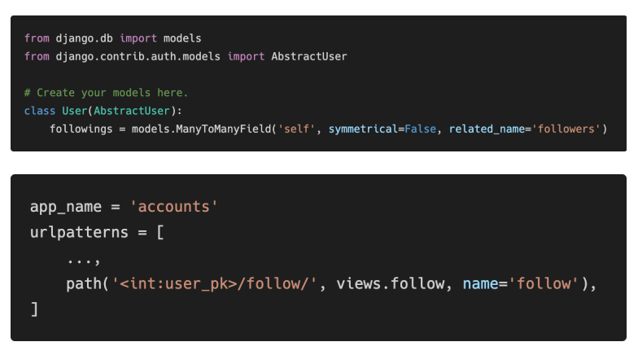
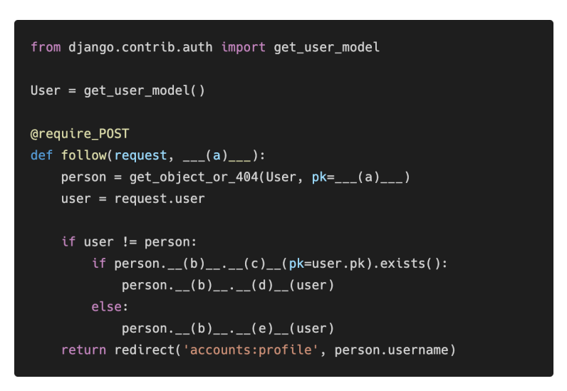
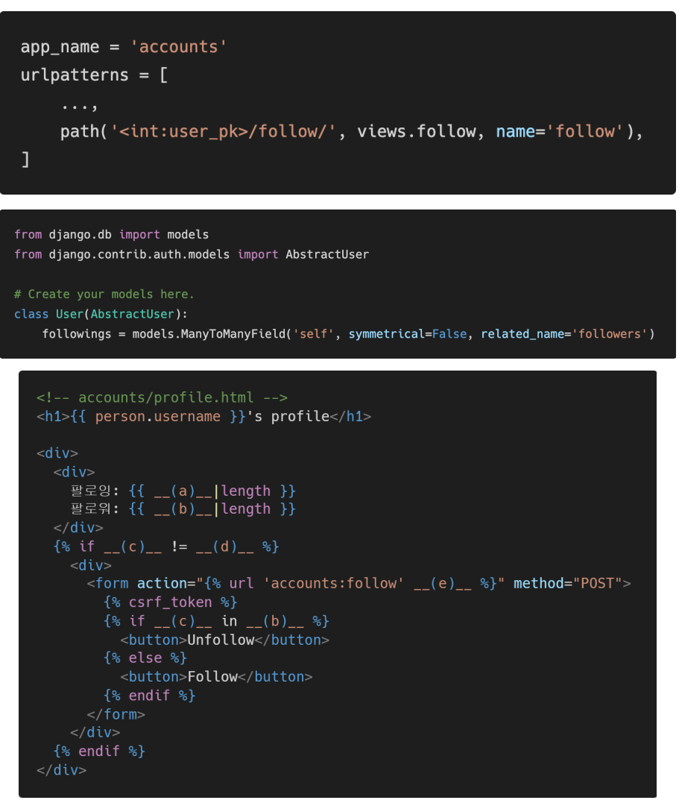

# HomeWork
### M:N True or False

각 문항을 읽고 맞으면 T, 틀리면 F를 작성하고, 틀렸다면 그 이유도 함께 작성하시오.

1. Django에서 1:N 관계는 ForeignKeyField를 사용하고, M:N 관계는 ManyToManyField를 사용한다.

2. ManyToManyField를 설정하고 만들어지는 테이블 이름은 “앱이름_클래스이름_지정한 필드이름”의 형태로 만들어진다.

3. ManyToManyField의 첫번째 인자는 참조할 모델, 두번째 인자는 related_name이 작성 되는데 두 가지 모두 필수적으로 들어가야 한다.

   

```
1. T
2. T
3. F related_name의 경우 optional하다. 하지만 주로 M:N관계에서는 반대 object의 이름을 작성한다.
작성하지 않을 때에는 object_set을 이용하여야 한다.
```


### Like in templates

아래 빈 칸 (a)와 (b)에 들어갈 코드를 각각 작성하시오.


```
(a) request.user
(b)	articles.like_users.all
```


### Follow in views

모델 정보가 다음과 같을 때 빈칸 a, b, c, d, e에 들어갈 코드를 각각 작성하시오.






```
(a) user_pk
(b) followers
(c) filtered
(d) remove
(e) add
```


### User AttributeError

다음과 같은 에러 메시지가 발생하는 이유와 이를 해결하기 위한 방법과 코드를 작성하시오.


```
UserCreationForm이 auth.User 모델을 참조하고 있는데, 해당 유저 모델이 변동하였으므로 문제가 발생하였다. 
이를 해결하기 위해선, UserCreationForm을 상속받은 새 ModelForm으로 대체해야한다.
```

```python
from django.contrib.auth.forms import UserCreationForm
from django.contrib.auth import get_user_model

class CustomUserCreationForm(UserCreationForm):
    
    class Meta(UserCreationForm.Meta):
        model = get_user_model()
        fields = UserCreationForm.Meta.fields
```


### related_name

아래의 경우 ForeignKey 혹은 ManyToManyField에 related_name을 필수적으로 작성해야 한다. 그 이유를 설명하시오. 


```
위의 경우, ForeignKey 혹은 ManyToManyField에 related_name을 필수적으로 작성해야 한다.
이는 해당 User가 작성한 글을 확인하기위한 user.article_set과
좋아요하기위한 user.article_set이 동일하기 때문에 하나를 related_name을 활용하여 바꾸어주어야한다.

```


### follow templates

person 변수에는 view함수에서 넘어온 유저 정보가 담겨 있고, 모델 정보가 아래와 같을 때 빈칸 a, b, c, d, e에 들어갈 알맞은 코드를 각각 작성하시오



```
(a) person.followings.all
(b) person,followers.all
(c) request.user
(d) person
(e) person.pk
```

