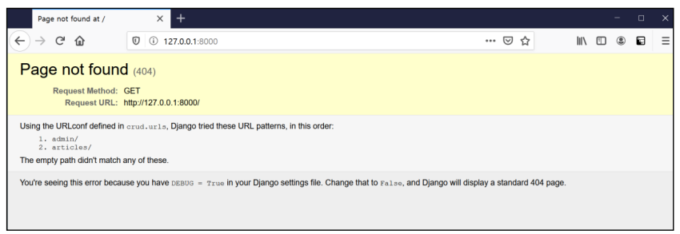

# HomeWork
### MTV

Django는 MTV로 이루어진 Web Framework다. MTV가 무엇의 약자이며 Django에서 각각 어떤 역할을 하고 있는지 작성하시오.

```
M: Model 데이터베이스 스키마 및 변경 담당 (Model)
T: Template 사용자에게 보여지는 부분을 담당 (View)
V: View 내부 로직들을 담당 (Controller)
```


### 404 Page not found

기본적으로 ‘/ ’ 페이지에 접속하게 되면 아래 사진처럼 Page not found 에러가 발생한다. ‘/ ’ 페이지에 접속했을 때 index.html를 렌더링 하고자 한다. 아래 빈칸에 알맞은 코드를 작성하시오. (프로젝트의 이름은 crud 이며 app 이름은 articles이다. index.html 파일을 렌더링 하는 view 함수의 이름은 index라고 가정한다.)




```
(a) .
(b) views
(c) views.index
```


### templates and static

Django 프로젝트는 기본적으로 render 할 html과 같은 template 파일과 css, js와 같은 static 파일을 앱 폴더 내부의 templates와 static 이름의 폴더에서 찾는다. 만약 해당 위치가 아닌 임의의 위치에 파일을 위치 시키고 싶으면 __(a)__ 파일의 __(b)__와 __(c)__ 라는 변수에 담긴 리스트의 요소를 정의하면 된다. 
빈칸 (a), (b), (c)에 들어갈 내용을 작성하시오.

```
(a) settings.py
(b) Templates
(c) STATIC_ROOT
```


### migration

아래는 그림과 같이 Django에서 선언한 Model을 Database에 반영하는 과정에서 사용하는 명령어에 대한 설명이다. 각 설명에 해당하는 명령어를 작성하시오. (app 이름은 articles이다.)


1. 마이그레이션 생성

   `python manage.py makemigrations`

2. 마이그레이션 DB 반영 여부 확인

   `python manage.py showmigrations`

3. 마이그레이션에 대응되는 SQL문 출력

   `python manage.py sqlmigrate`

4) 마이그레이션 파일의 내용을 DB에 최종 반영

​		`python manage.py migrate`

### ModelForm True or False

각 문항을 읽고 맞으면 T, 틀리면 F를 작성하시오.

1. POST와 GET 방식은 의미론상의 차이이며 실제 동작 방식은 동일하다.

     `F POST요청은 데이터를 서버로 제출하기 위한 방식으로 바디에 데이터를 포함 시키는 반면 GET요청의 경우 header에 데이터를 포함한다.`

2. ModelForm과 Form Class의 핵심 차이는 Model의 정보를 알고 있는지의 여부이다.

     `T`

3) AuthenticationForm은 User 모델과 관련된 정보를 이미 알고 있는 ModelForm으로
    구성되어 있다.
    
    `F 단순히 ID와 password를 제출하는 Form이다.`
    
    - is_valid 어떻게 확인할까?
    
4. ModelForm을 사용할 때 Meta 클래스에 fields 관련 옵션은 반드시 작성해야 한다

     `T fields 또는 exclude를 작성하여야 한다.`


### media 파일 경로

사용자가 업로드한 파일이 저장되는 위치를 Django 프로젝트 폴더(crud) 내부의 /uploaded_files 폴더로 지정하고자 한다. 이 때, settings.py에 작성해야 하는 설정 2가지를 작성하시오.

```
MEDIA_ROOT = 'uploaded_files/'
MEDIA_URL = 'upload/'
```


### DB True or False

각 문항을 읽고 맞으면 T, 틀리면 F를 작성하시오.

1. RDBMS를 조작하기 위해서 SQL문을 사용한다.

   `T`

2. SQL에서 명령어는 반드시 대문자로 작성해야 동작한다.

   `F 대소문자 구분하지 않는다.`

3. 일반적인 SQL문에서는 세미콜론( ; )까지를 하나의 명령어로 간주한다.

   `T`

4. SQLite에서 .tables, .headers on과 같은 dot( . )로 시작하는 명령어는 SQL문이 아니다.

   `T`

5. 하나의 데이터베이스 안에는 반드시 한 개의 테이블만 존재해야 한다.

   `F 여러개의 테이블이 존재할 수 있다.`


### on_delete

게시글과 댓글의 관계에서 댓글이 존재하는 게시글은 삭제할 수 없도록 즉, ProtectedError를 발생시켜 참조 된 객체의 삭제를 방지하는 __(a)__를 작성하시오.


`(a) protected`

### Like in models

Article 모델과 User 모델을 M:N 관계로 설정하여 ‘좋아요’ 기능을 구현하려고 한다. __(a)__와 __(b)__에 들어갈 내용을 작성하시오. 


```
(a) ManytoManyFields
(b) related_name
```


### Follow in models

follow 기능을 구현하기 위해 accounts app의 models.py에 아래와 같은 모델을 작성하였다. Migration 작업 이후에 Database에 만들어지는 중개 테이블의 이름을 작성하고 이 테이블의 id를 제외한 컬럼 이름을 각각 작성하시오.


```
accounts_user_followings
from_user_id, to_user_id
```


