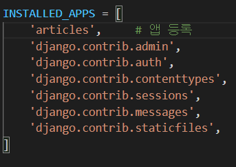

# Django

Python Web framework => 수레의 바퀴를 다시 발명하지 말자!

## Web

### Static web page (정적 웹 페이지)

* 서버에 미리 저장된 파일이 사용자에게 그대로 전달 되는 웹 페이지
  * 모든 상황에서 모든 사용자에게 동일한 정보를 표시

### Dynamic web page (동적 웹 페이지)

* 웹 페이지에 대한 요청을 받은 경우 서버는 추가적인 처리과정 이후 클라이언트에게 응답을 보냄
  * 사용자와 상호작용 하기 때문에 페이지 내용은 그때그때 다름


### Framework

* 프로그래밍에서 특정 운영 체제를 위한 응용 프로그램 표준 구조를 구현하는 클래스와 라이브러리 모임
* 재사용할 수 있는 수많은 코드를 프레임 워크로 통합 => 표준 코드를 다시 작성하지 않아도 사용 가능


### Web framework

* 웹 페이지를 개발하는 과정에서 엮는 어려움을 줄이는 것이 주 목적


#### Framework Architecture

* MVC Design Pattern(model-view -controller)
  * Django는 MTV Pattern이라고 함


#### MTV Pattern

* Model
  * 응용 프로그램의 데이터 구조를 정의하고 데이터베이스의 기록을 관리 (추가, 수정, 삭제)
* Template (View)
  * 파일의 구조나 레이아웃을 정의
  * 실제 내용을 보여주는데 사용(presentation)
* View (controller)
  * HTTP 요청을 수신하고 HTTP 응답을 반환
  * Model을 통해 요청을 충족시키는데 필요한 데이터에 접근
  * Template에게 응답의 서식 설정을 맡김


1. HTTP Request
2. URLS => view를 찾아 렌더링 해서 
3. View
4. HTTP Response
5. 

## Django Intro

### 가상환경 설정

```bash 
# 0.gitignore 설정
# 1. 가상환경 생성 및 활성화
$ python -m venv venv_name
$ source venv_name/Script/activate

# 2. 장고 설치
$ pip install django==3.2.12

# 3. 프로젝트 생성
$ django-admin startproject project_name .

# 4. Run Server
$ python manage.py runserver

# 5. App 생성
$ python manage.py startapp application_name
# 6. App 등록
```


#### 프로젝트 구조

`__init__.py`(x) : Python에게 이 디렉토리를 하나의 Python 패키지로 다루도록 지시

`asgi.py`(x) : Djanggo 애플리케이션이 비동기식 웹 서버와 연결 및 소통하는 것을 도움

`setting.py` : 애플리케이션의 모든 설정을 포함

`ulrs.py` : 사이트의 url과 적절한 views의 연결을 지정

`wsgi.py`(x) : Web Server Gateway Interface, 웹서버와 연결 및 소통하는 것을 도움

`manage.py`(x) : Django 프로젝트와 다양한 방법으로 상호작용하는 커맨드라인 유틸리티


#### Application 생성

```bash
$ python manage.py startapp application_name
```

* 일반적으로 Application명은 복수형으로 권장


#### Application 구조

`admin.py` (x): 관리자용 페이지를 설정하는 곳

`apps.py` : 앱의 정보가 작성된 곳

`models.py` : 앱에서 사용하는 Model을 정의하는 곳

`tests.py` (x): 프로젝트의 테스트 코드를 작성하는 곳

`views.py` : view 함수들이 정의되는 곳


### Project & Application

#### Project

* Project는 Application의 집합
* 프로젝트에는 여러 앱이 포함될 수 있음
* 프로젝트는 앞으로 생성될 어플리케이션의 다양한 설정 파일 제공

#### Application

* 앱은 실제 요청을 처리하고 페이지를 보여주고 하는 등의 역할을 담당

* 하나의 프로젝트는 여러 앱을 가짐

* 일반적으로 앱은 하나의 역할 및 기능 단위로 작성함


#### 앱등록

settings.py => INSTALLED_APPS

* 장고에 활성화 된 모든 앱을 지정하는 문자열 목록
* 생성 후 등록!




### Django Template

* 데이터 표현을 제어하는 도구이자 표현에 관련된 로직
* URL => View => Template


#### Django Teplate Language(DTL)

* 조건, 반복, 변수 치환, 필터 등의 기능 제공

* Python Logic이 HTML에 포함 된 것이 아니며 프로그래밍적 로직이 아니라 프레젠테이션을 표현하기 위한 것

* Python처럼 일부 프로그래밍 구조를 사용할 수 있지만 이것은 해당 Python 코드로 실행되는 것이 아님.

  

* ##### Variable `{{ variable }}`

  * render()를 사용하여 views.py에서 정의한 변수를 template 파일로 넘겨 사용하는 것
  * dot(.)를 사용하여 변수 속성에 접근할 수 있음
  * render()의 세번째 인자로 {'key':value}와 같이 딕셔너리 형태로 넘겨주며, 여기서 정의한 key에 해당하는 문자열이 template에서 사용가능한 변수명이 됨

* ##### Filter `{{ variable|filter }}`

  * 표시할 변수를 수정할 때 사용

* ##### Tags

  * 출력 텍스트를 만들거나, 반복 또는 논리를 수행하여 제어 흐름을 만드는 등 변수보다 복잡한 일들을 수행
  * 일부 태그는 시작과 종료 태그가 필요

* ##### Comment `{# #}`

  * 주석을 표현하기 위해 사용


#### Template inheritance (템플릿 상속)

* 코드의 재사용성에 초점을 맞춤

* 템플릿 상속을 활용하면 사이트의 모든 공통 요소를 포함하고, 하위 템플릿이 재정의(override) 할 수 있는 블록을 정의하는 기본 "skeleton"템플릿을 만들 수 있음

* `tags`

  ```django
  
  자식 템플릿이 부모 템플릿을 확장한다는 것을 알림
  반드시 템플릿 최 상단에 작성 되어야함
  
   
  하위 템플릿에서 재지정(override)할 수 있는 블록을 정의
  
  
  템플릿을 로드하고 현재 페이지로 렌더링
  템플릿 내에 다른 템플릿을 "포함(including)"하는 방법
  ```


#### Django Template 철학

* 표현과 로직(view)을 분리
  * 템플릿 시스템은 표현을 제어하는 도구이자 표현에 관련된 로직일 뿐이라고 생각한다.
  * 즉, 템플릿은 이러한 기본 목표를 넘어서지 않아야한다.
* 중복을 배제
  * 상속의 기초


### Model

* 단일한 데이터에 대한 정보를 가짐
  * 사용자가 저장하는 데이터들의 필수적인 필드들과 동작들을 포함
* 저장된 데이터베이스의 구조
* 일반적으로 각각의 Model은 하나의 데이터베이스 테이블에 매핑됨


#### Database

* 데이터베이스(DB)
  * 체계화된 데이터의 모임
* 쿼리(Query)
  * 데이터를 조회하기 위한 명령어
  * 조건에 맞는 데이터를 추출하거나 조작하는 명령어
  * Query를 날린다. => DB를 조작한다.

##### 데이터 베이스의 기본구조

* 스키마
  * 데이터베이스에서 자료의 구조, 표현방법, 관계 등을 정의한 구조(structure)
* 테이블(Table)
  * 열(column) : 필드(field) or 속성
  * 행(row) : 레코드(record) or tuple


#### ORM(Object-Relational-Mapping)

* 객체 지향 프로그래밍 언어를 사용하여 호환되지 않는 유형의 시스템간에 데이터를 변환하는 프로그래밍 기술

* OOP 프로그래밍에서 RDBMS을 연동할 때, 데이터베이스와 객체 지향 프로그래밍 언어 간의 호환

* 장점
  * SQL을 잘 알지 못해도 DB조작이 가능
  * SQL의 절차적 접근이 아닌 객체 지향적 접근으로 인한 높은 생산석
* 단점
  * ORM만으로 완전한 서비스를 구현하기 어려운 경우가 있음
* 현대 웹 프레임워크의 요점은 웹 개발의 속도를 높이는 것
* DB를 객체로 조작하기 위해 ORM사용!


#### 사용 모델 필드

* CharField(max_length=None, **options)
  * 길이의 제한이 있는 문자열을 넣을 때 사용하는 Field
* TextField(**options)
  * 글자의 수가 많을 때 사용
  * max_length 옵션 작성시 자동 양식 필드인 textarea 위젯에 반영은 되지만 모델과 데이터베이스 수준에는 적용되지 않음
    * max_length사용은 CharField에서 사용해야함 


#### Migrations

* DJANGO가 모델에 생긴 변화를 알 수 있게 하는 것

* DB 직접 수정은 좋지 않다.
* 생성 했으면 생성한 내용만 남겨 놓기


1. makemigrations (설계도 생성)

   * model을 변경한 것에 기반한 새로운 마이그레이션(like 설계도)을 만들 때 사용

   ```bash
   $python manage.py makemigrations
   ```

   

2. migrate (DB에 반영)

   * 마이그레이션을 DB에 반영하기 위해 사용
   * 설계도를 실제 DB에 반영하는 과정
   * 모델에서의 변경 사항들과 DB의 스키마가 동기화를 이룸

   ```bash
   $ python manage.py migrate app_name migration_name
   ```

3. sqlmigrate

   * 마이그레이션에 대한 SQL 구문을 보기 위해 사용
   * 마이그레이션이 SQL문으로 어떻게 해석되어서 동작할지 미리 확인 할 수 있음

   ```bash
   $ python manage.py sqlmigration
   ```

   

4. showmigrations

   * 프로젝트 전체의 마이그레이션 상태를 확인하기 위해 사용
   * 마이그레이션 파일들이 migrate 됐는지 안됐는지 여부를 확인할 수 있읍


### Databse API

* Database를 조작하기 위한 도구 

* django가 기본적으로 ORM을 제공함에 따른 것으로 DB를 편하게 조작할 수 있도록 도움

* Model을 만들면 django는 객체들을 만들고 읽고 수정하고 지울 수 있는

* Making Queries
  * `class_name.manager.QuerySetApi()` `[Article.objects.all()]`
  
* manager
  *  django 모델에 데이터베이스 query 작업이 제공되는 인터페이스
  * 기본적으로 모든 django 모델 클래스에 objects 라는 Manager을 추가
  
* QuerySet
  * 데이터베이스로부터 전달받은 객체 목록
  
  * queryset 안의 객체는 0개, 1개 혹은 여러개일 수 있음
  
  * 데이터베이스로부터 조회, 필터, 정렬  등을 수행할 수 있음
  
  * create, delete, read, filter 등
  
    

#### Django Shell

* 일반 Python shell을 통해서는 장고 프로젝트 환경에 접근할 수 없음

* 그래서 장고 프로젝트 설정이 load된 Python shell을 활용해 DB API 구문 테스트 진행

* 기본 Django_shell 보다 더 많은 기능을 제공하는 shell_plus를 사용해서 진행

  ```bash
  $ pip install ipython django-extentions
  ```

  

### CRUD

* 대부분의 컴퓨터 소프트웨어가 가지는 기본적인 데이터 처리 기능인

  Create(생성), Read(조회), Update(수정), Delete(삭제)를 묶어서 일컫는 말


#### Create 

1. 인스턴스 만들고 값 저장하고 save하기 => save 하기 전에 유효성 검사 가능

2. 인스턴스 만들 때 부터 초기값과 함께 인스턴스 생성 

3. QuerySetApi사용하기 - Article.objects.create()하기 => 바로 생성된다.

   

#### Read

* `all()`
  * 현재 QuerySet 전체 조회 시 사용

* `get()`
  * 딱 하나를 찾을 때 사용
  * 여러개의 항목이 찾아질 때 오류
    * MultipleObjectReturned
    * 사용할 때는 고유성을 보장하는 필드 사용해야 한다. ex)PK
  * 없는 항목 찾을 때 오류
    * DoesNotExsist

* `filter()`
  * 주어진 lookup 매개변수와 일치하는 객체를 포함하는 새 QuerySet을 반환
  * 정확하게 일치할 때만 받아 올 수 있다


#### Update

* get으로 정확히 하나 가져오는 것부터 시작

  ```python
  article = Article.Objects.get(pk=1)
  ```

* 수정

  ```python
  article.title = '장고'
  article.content = '첫번째 게시물'
  ```

* 저장 `save()`

  ```python
  article.save()
  ```

  

#### Delete

* get으로 정확히 하나 가져오는 것부터 시작

  ```python
  article = Article.Objects.get(pk=1)
  ```

* 삭제 `delete()`

  ```python
  article.delete()
  ```


### 관리자 만들기

```bash
$ python manage.py createsuperuser
```


#### GET

* 특정 리소스를 가져오도록 요청할 때 사용
* 반드시 데이터를 가져올 때만 사용해야 함
* DB에 영향을 주지 않음
* CRUD에서 R 역할을 담당

#### POST

* 서버로 데이터를 전송할 때 사용
* 리소스를 생성/변경하기 위해 데이터를 HTTP body에 담아 전송
* 서버에 변경사항 만듬
* CRUD에서 C U D 담당


##### Middleware

공통 서비스 및 시능을 애플리케이션에 제공하는 소프트웨어

데이터 관리, 애플리케이션 서비스, 메시징, 인증, API관리를 주로 미들웨어를 통해 처리

개발자들이 애플리케이션을 보다 효율적으로 구축할 수 있도록 지원하며 애플리케이션, 데이터 및 사용자 사이를 연결하는 요소처럼 작동

