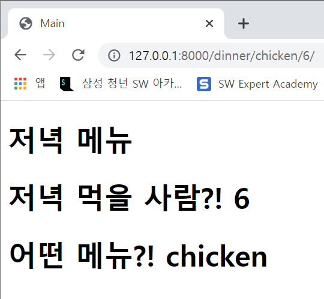

# WorkShop

### 결과 예시

결과 사진과 views.py, urls.py, dinner.html 파일의 코드를 별도의 마크다운 파일에 작성하여 제출하시오.



---

1. intro/views.py

```python
from django.shortcuts import render

# Create your views here.
def dinner(request, menu=None, numberofpeople=None):
    if menu == None and numberofpeople == None:
        menu = request.GET.get('menu')
        numberofpeople = request.GET.get('numberofpeople')

    context = {
        'menu': menu,
        'numberofpeople':numberofpeople,
    }
    return render(request, 'dinner.html', context)
```


2. intro/urls.py

```python
from django.contrib import admin
from django.urls import path
from pages import views

urlpatterns = [
    path('admin/', admin.site.urls),
    path('dinner/', views.dinner),
    path('dinner/<str:menu>/<int:numberofpeople>/', views.dinner),
]
```


3. pages/templates/dinner.html

```django
<!DOCTYPE html>
<html lang="en">
<head>
  <meta charset="UTF-8">
  <meta http-equiv="X-UA-Compatible" content="IE=edge">
  <meta name="viewport" content="width=device-width, initial-scale=1.0">
  <title>Document</title>
</head>
<body>
  <h1>저녁 메뉴</h1>
  <h1>저녁 먹을 사람?! {{ numberofpeople }}</h1>
  <h1>어떤 메뉴?! {{ menu }}</h1>
</body>
</html>
```

