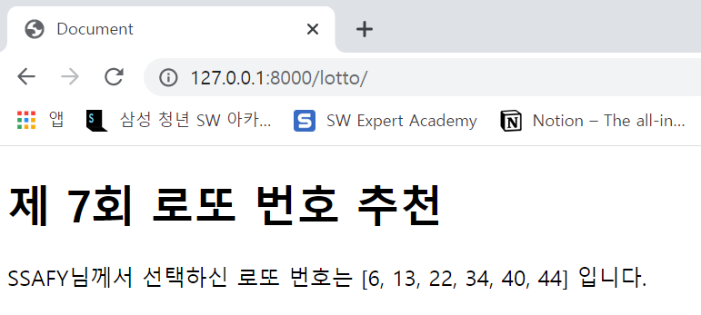

# WorkShop

### 결과 예시

결과 사진과 views.py, urls.py, lotto.html 파일의 코드를 별도의 마크다운 파일에 작성하여 제출하시오.



views.py

```python
from django.shortcuts import render
from random import sample
# Create your views here.
def lotto(request):
    pick = sample(range(1, 45), 6)
    pick.sort()
    context = {
        'pick': pick
    }
    return render(request, 'lotto.html', context)
```


urls.py

```python
from django.contrib import admin
from django.urls import path
from pages import views

urlpatterns = [
    path('admin/', admin.site.urls),
    path('lotto/', views.lotto, name='lotto')
]
```


lotto.html

```django
<!DOCTYPE html>
<html lang="en">
<head>
  <meta charset="UTF-8">
  <meta http-equiv="X-UA-Compatible" content="IE=edge">
  <meta name="viewport" content="width=device-width, initial-scale=1.0">
  <title>Document</title>
</head>
<body>
  <h1>제 7회 로또 번호 추천</h1>
  <p>SSAFY님께서 선택하신 로또 번호는 {{ pick }} 입니다.</p>
</body>
</html>
```

