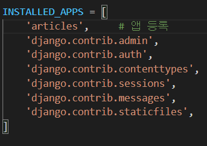

# Django

Python Web framework => 수레의 바퀴를 다시 발명하지 말자!

## Web

### Static web page (정적 웹 페이지)

* 서버에 미리 저장된 파일이 사용자에게 그대로 전달 되는 웹 페이지
  * 모든 상황에서 모든 사용자에게 동일한 정보를 표시

### Dynamic web page (동적 웹 페이지)

* 웹 페이지에 대한 요청을 받은 경우 서버는 추가적인 처리과정 이후 클라이언트에게 응답을 보냄
  * 사용자와 상호작용 하기 때문에 페이지 내용은 그때그때 다름


### Framework

* 프로그래밍에서 특정 운영 체제를 위한 응용 프로그램 표준 구조를 구현하는 클래스와 라이브러리 모임
* 재사용할 수 있는 수많은 코드를 프레임 워크로 통합 => 표준 코드를 다시 작성하지 않아도 사용 가능


### Web framework

* 웹 페이지를 개발하는 과정에서 엮는 어려움을 줄이는 것이 주 목적


#### Framework Architecture

* MVC Design Pattern(model-view -controller)
  * Django는 MTV Pattern이라고 함


#### MTV Pattern

* Model
  * 응용 프로그램의 데이터 구조를 정의하고 데이터베이스의 기록을 관리 (추가, 수정, 삭제)
* Template (View)
  * 파일의 구조나 레이아웃을 정의
  * 실제 내용을 보여주는데 사용(presentation)
* View (controller)
  * HTTP 요청을 수신하고 HTTP 응답을 반환
  * Model을 통해 요청을 충족시키는데 필요한 데이터에 접근
  * Template에게 응답의 서식 설정을 맡김


1. HTTP Request
2. URLS => view를 찾아 렌더링 해서 
3. View
4. HTTP Response
5. 

## Django Intro

### 가상환경 설정

```bash 
# 0.gitignore 설정
# 1. 가상환경 생성 및 활성화
$ python -m venv venv_name
$ source venv_name/Script/activate

# 2. 장고 설치
$ pip install django==3.2.12

# 3. 프로젝트 생성
$ django-admin startproject project_name .

# 4. Run Server
$ python manage.py runserver

# 5. App 생성
# 6. App 등록
```


#### 프로젝트 구조

`\__init__.py`(x) : Python에게 이 디렉토리를 하나의 Python 패키지로 다루도록 지시

`asgi.py`(x) : Djanggo 애플리케이션이 비동기식 웹 서버와 연결 및 소통하는 것을 도움

`setting.py` : 애플리케이션의 모든 설정을 포함

`ulrs.py` : 사이트의 url과 적절한 views의 연결을 지정

`wsgi.py`(x) : Web Server Gateway Interface, 웹서버와 연결 및 소통하는 것을 도움

`manage.py`(x) : Django 프로젝트와 다양한 방법으로 상호작용하는 커맨드라인 유틸리티


#### Application 생성

```bash
$ python manage.py startapp application_name
```

* 일반적으로 Application명은 복수형으로 권장


#### Application 구조

`admin.py` (x): 관리자용 페이지를 설정하는 곳

`apps.py` : 앱의 정보가 작성된 곳

`models.py` : 앱에서 사용하는 Model을 정의하는 곳

`tests.py` (x): 프로젝트의 테스트 코드를 작성하는 곳

`views.py` : view 함수들이 정의되는 곳


### Project & Application

#### Project

* Project는 Application의 집합
* 프로젝트에는 여러 앱이 포함될 수 있음
* 프로젝트는 앞으로 생성될 어플리케이션의 다양한 설정 파일 제공

#### Application

* 앱은 실제 요청을 처리하고 페이지를 보여주고 하는 등의 역할을 담당

* 하나의 프로젝트는 여러 앱을 가짐

* 일반적으로 앱은 하나의 역할 및 기능 단위로 작성함


#### 앱등록

settings.py => INSTALLED_APPS

* 장고에 활성화 된 모든 앱을 지정하는 문자열 목록
* 생성 후 등록!

