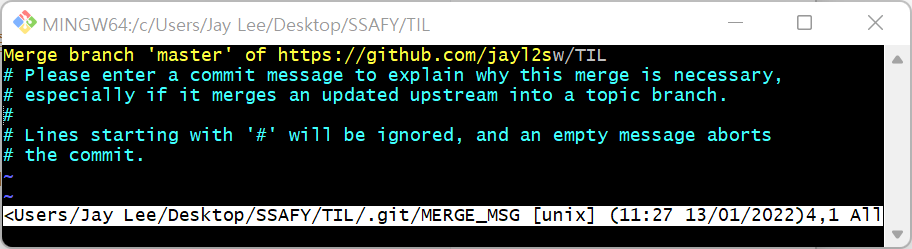

# Github

## 회원가입

### 설정 변경

* main 브랜치를 master 브랜치로 기본값 수정 (편의성 위해)


## 원격 저장소(Github)와 로컬 저장소(.git) 연결

### Repository 생성 및 파일 올리기

* `git remote` : `git remote add {단축 이름} {url}`

* `git push` : `git push {리모트 저장소 이름} {브랜치 이름}`

  `-u` : master라는 현재 브랜치를 자동으로 origin 이라는 원격 저장소의 master 브랜치로 연결

 ```bash
 # git으로 원격 저장소 설정을 할 때, origin이라는 별명을 가진 해당하는 주소(경로)로 업로드 할 수 있도록 설정
 # 처음 한번만 설정 
 $ git remote add origin http://github.com/jayl2sw/TIL.git 
 
 # master 브랜치에 있는 것을 origin 경로로 올린다.
 $ git push -u origin master 
 ```


* `user.name ` `user.email` : commit 한 사람이 누군지 알려주는 기능

```bash
$ cat .git/config # .git에 대한 정보를 볼 수 있다.
```

* Repository와 commit 하는 사람이 다르면 자격 오류가 발생한다. (403)
  * 아이디 교체를 위해서는 자격 증명 관리자 - 편집 or 제거 후 재로그인
  * 아이디 교체 후 저장소와 로컬이 같으면 Everything up-to-date


* `git ignore` : private한 자료가 있기 때문에 git으로 관리하지 않는다.

  * 안에 file_name.확장자명 작성, 하지만 주로 gitignore.io 이용

  * .git folder와 완전히 동일한 위치에다가 생성 (상대경로로 이루어져 있기 때문에)

  * 새로운 프로젝트를 시작할 때, 가장 먼저 최상단에 만들어 놓고 프로젝트 진행

```bash
# gitignore 생성하기 
$ touch .gitignore 

# 원격 저장소에도 파일이 있고, 로컬에도 이미 있고, 이미 트래킹 중인 파일을 로컬에서만 더 이상 추적하지 않도록 설정
$ git update-index --ssume-unchanged {file_name}

# 로컬에 있는 파일 변동 추적 멈춤, 원격 저장소에 해당 파일이 이미 있다면 (push 할 때) 그 파일 삭제 
# 삭제 했다는 사실을 git에 남긴다, 추적 사실만 삭제.
$ git rm --cached {file_name}

# 로컬, 원격 저장소 모두 파일 삭제 후 추적 중지
$ git rm {file_name}
```


---

### Repository에서 파일 받아오기

1. `pull` : git을 통해서 원격 저장소에 있는 버전과, 로컬에 있는 버전을 동일하게 만드는 방법 
   
   * git에 대한 정보가 있을 때만 사용 가능하다.
   * 다른 곳에서 작업한 내용들을 집에서 작업할 때 사용
   * **작업전에 항상 pull 작업을 해야한다.**
     * 원격 저장소의 변화를 먼저 통합시켜야 한다.
   
   `merge` : `pull`을 하지 않고 작업한  두개의 commit을 합치는 것 (원격 저장소 + 로컬 저장소)

```bash
$ git pull {원격 저장소 별명} {브랜치 이름}
```


2. `clone` : 제일 처음 원격 저장소에 있는 내용을 받아올 때(git에 대한 설정,log 등 다 남아있다.)
   * 주소를 찾아야 한다,  이미 해당하는 폴더가 있으면 clone이 되지 않음

```bash
$ git clone {Repository_주소}
```


---

## 충돌

1. 서로 다릉 파일을 pull 받지 않고 push 했을 때,
   * : w q 통해서 merge 



2. 같은 파일을 pull 받지 않고 push 했을 때
   * 같은 위치를 변경 했을때, 자동으로 합칠 수 없다. (둘 중에 뭐쓸지 물어봄)
   * 그냥 변경 후에 다시 add commit push 하면 된다.


