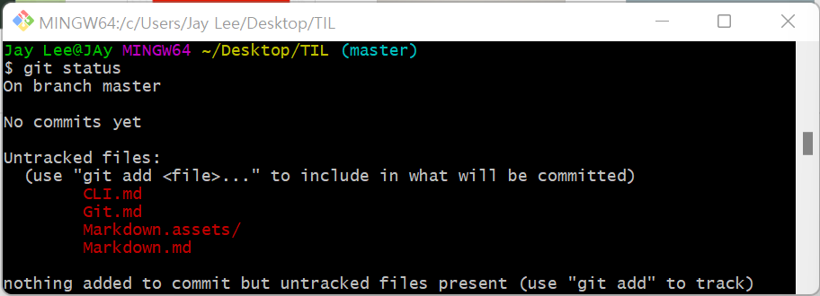
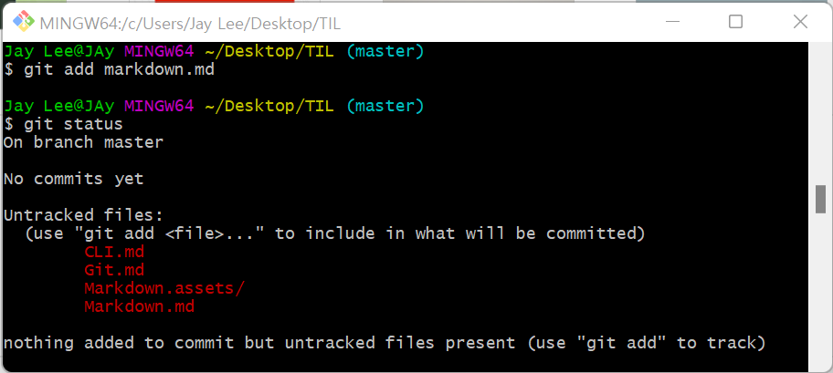
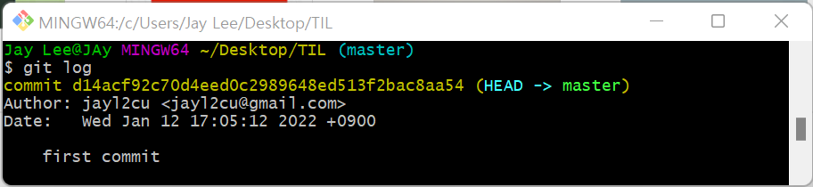
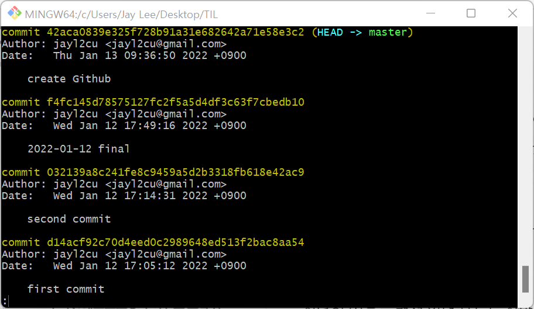

# GIT

### 초기설정

* 최초 한번만 설정합니다.

1. Commit (버전 상태 만듬) 누가 커밋을 남겼는지 확인 할 수 있도록 이름과 이메일을 설정합니다.

```bash
# - 하나는 축약문 -- 전체단어 
# ex) -o --option , but 축약문은 겹칠 수 있다.

$ git config --global user.name jayl2cu
$ git config --global user.email jayl2cu@gmail.com
```

2. 설정된 내용 확인

```bash
$ git config --global --list
# or
$ git config --global -l
```


---

파일 저장의 단위가 버전이다.

무엇인가를 명령하기 위해너는 결과값을 읽을 줄 알아야 한다.   

---

Working Directory (TIL folder)

Staging Area : Commit  하기 위해서 

초기화 Tracking 추적 시작 --> 하나의 version 

Tracking을 안한다? (무엇이 변화했는지 모른다.) 

* `add` : 추적 시작

잘게잘게 짜르고 싶으면 추적상태를 만들어야 한다 (add)

* `commit` : 그 상태를 하나 만듬 (Add Version)

원격저장소 (Github)에 Commit들을 넣음

* `push`:이 때, 깃에 있는 것들을 원격 저장소로 넣는 과정


---

### git init

```bash
$ git init # 현재 작업중인 directory git으로 관리
Jay Lee@JAy MingW64 ~/Desktop/TIL (master) # (master) 떠있으면 git 생성
```

##### 주의사항

* 이미 master로 관리중인 폴더 내에서 **절대 git init 금지**

  

---

### git status

* Working directory와 Staging Area에 있는 파일들의 현재 상태를 확인한다.

1. `untracked` : Tracking 시작하지 않았다 = Staging Area에 들어가지 않았다.

2. `tracked`: git이 관리하는 파일
   1. `Unmodified` : 최신 상태
   2. `Modified` : 수정되었지만 commit을 남기기 전 
   3. `staged` : Staging area에 반영된 상태





---

### git add

```bash
# 특정 파일
$ git add file_name.txt

# 특정 폴더
$ git add folder/

# 현재 디렉토리에 속한 모든 파일/폴더
$ git add . 
```


---

### git commit

* Staging Area에 올라온 파이르이 변경사항을 하나의 버전으로 저장하는 명령어

* `commit message` : 현재 변경 사항을 기록하는 용도

```bash
$ git commit -m "커밋 메세지"
```





---

### git log

* 커밋의 내역을 조회할 수 있는 명령어

* 옵션

  `--oneline` : 한 줄로 축약해서 보여줍니다.

  `--graph` : 브랜치(사람별 분화)와 머지 내력을 그래프로 보여주는 명령어

  `--all` : 모든 브랜치의 내역

  `--reverse` : 커밋 내의 오래된 순서대로 보여줌

```bash
$ git log
```







* `q`를 눌러서 나갈 수 있다

---

