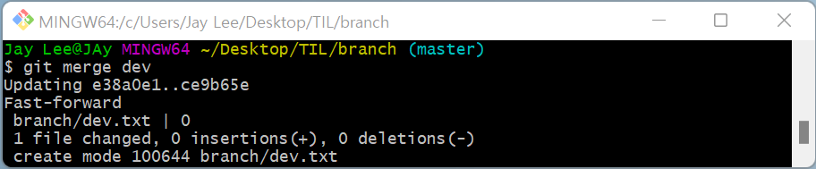
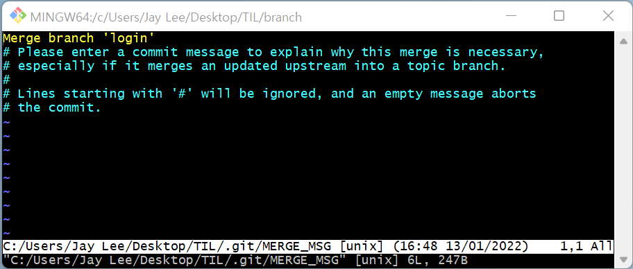
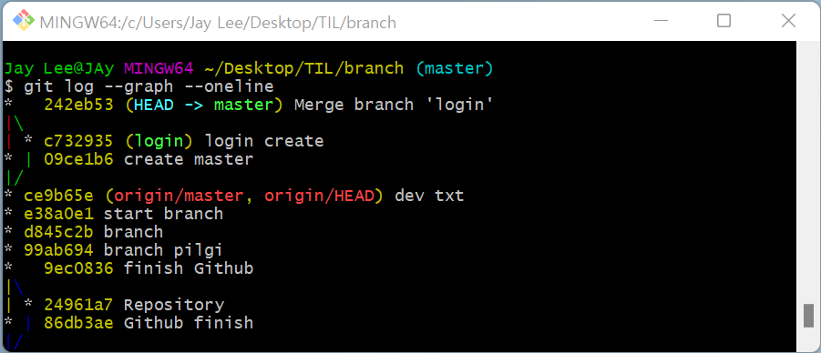
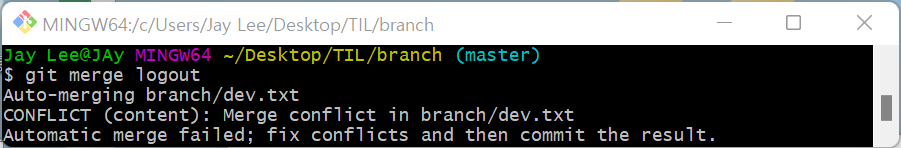
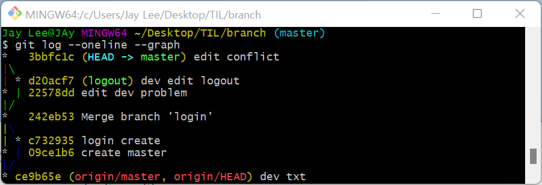

# branch  

* add -> commit -> push -> 팀원에게 알리기 -> 팀원 pull

* 커뮤니케이션이 중요 !

  하지만 이렇게 항상 알릴 수 는 없기 때문에 branch를 사용한다.


* 일반적으로 사용 하는 branch 명 :  

  * `master` : 성역 (함부로 건들지 않는다.)

  * `dev` : develop (여러가지 기능)

  * `chat` : Chat 기능

  * `release` : master에 합치기 전에 최종 테스트

  * `hot fix` : 급하게 버그 또는 문제가 발생했을 때 사용 

* `merge`를 통해 나중에 병합
* 저기에 있는 개발 내역을 나한테 가지고 온다.

---

### branch 명령어 

* 브랜치 `생성, 삭제, 조회` 명령어

```bash
# 브랜치 조회
$ git branch

# 원격 저장소의 브랜치 목록 확인
$ git branch -r

# 브랜치 생성
$ git branch {branch_name}

# 브랜치 삭제
# 병합된 (수정내역을 합치고 난 후에 삭제 가능)
$ git branch -d {branch_name}

# (주의) 병합되지 않은 브랜치 강제 삭제
$ git branch -D {branch_name}
```


---

### git switch

* 현재 브랜치에서 다른 브랜치로 `HEAD`를 이동시키는 명령어

* `HEAD`는 현재 브랜치를 가리키는 포인터

```bash
# 다른 브랜치로 이동
$ git switch {다른 브랜치 이름}

# 브랜치를 새로 생성하고 동시에 이동
$ git switch -c {다른 브랜치 이름}


```


* **주의사항**

  git switch 하기 전에 commit 하셨나요? 

  add, commit을 안하면 파일이 어느 브랜치에 있는지 모른다 

  

---

### git merge

`merge` : 두개의 branch를 합친다

```bash
# master에서 가져올 버전이 있는 branch를 가져온다
$ git merge {가져올 branch}
```

* `Fast-forward` : master에 변화가 없을 때, 
  * 두개를 합쳤을 때, 새로운 버전을 만드는 것이 아닌 dev가 master한테 감



​		

* `Merge made by the 'ort' strategy ` : 3-way Merge (merge commit)
  * master에 새로운 커밋 버전이 만들어 지면서 두개 합침



* : w q (write quit)

* if `i` or `a` or `insert` 를 누르면 `--끼워넣기--` 생김
  * 수정 할 수 있는 상태가 됨, 수정 끝나면 esc




<Merge 후엔 branch 삭제>


---

### conflict

* 둘이서 똑같은 파일의 똑같은 줄 수정




* 수정한 후 add - commit - push 하면 된다.




---

< git add . >

현재 폴더를 모두 add

따라서 상위 폴더에 있는 수정사항들은 untracked

=> git status 자주 확인

