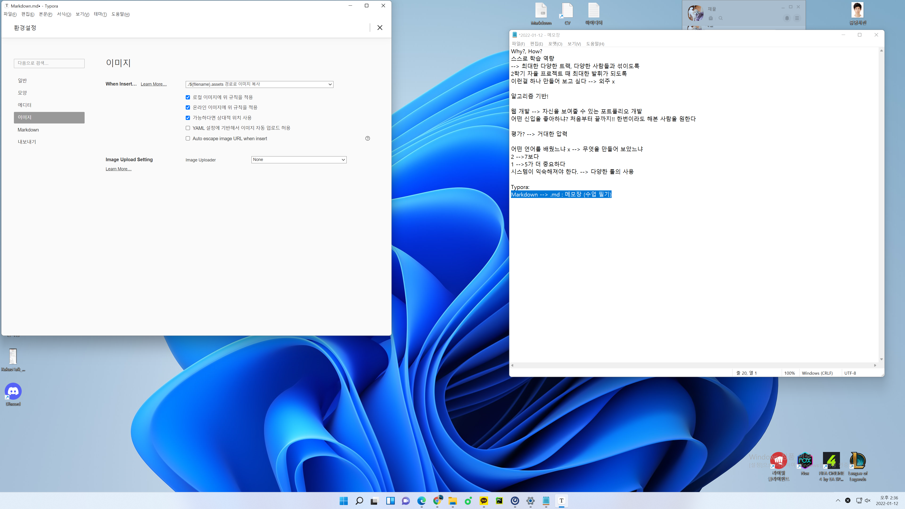

# Markdown

* .md : 메모장 (수업 필기)

* `<h1>  </h1>` < Mark up

* `#`   <  Markdown

  

## 마크다운의 특징

### 마크다운의 장점

1. 문법이 직관적이고 쉽습니다.
2. 관리가 쉽다.
3. 지원 가능한 플랫폼이 다양하다.


### 마크다운 단점

1. 정해져 있는 표준이 없다. 
2. 처음 학습하는 코스트가 발생한다.
3. HTML의 모든 마크업 기능을 대신 하지는 못한다.


### 주의사항

1. 마크다운의 본질은 글에게 역할을 부여하는 것입니다.
2. 정해진 역할에 맞는 문법을 사용해야합니다. 
3. 글씨의 **크기를 키우고 싶다** ((`ctrl + b`)로 진하게)고 내용의 제목에 해당하는 역할을 부여하면 곤란하다.

---


## 마크다운 문법

### 제목 (Heading) 

1. `#` 사용 
2. 만약 Heading 1으로 변경하고 싶다면 ? `ctrl + 1`
   * h1 - h6 까지 있다.


### list (목록)

1. 순서가 있는 목록 (숫자로 작성 됨) `1. + space bar`

- `-` : 순서가 없는 목록 1
- `*` : 순서가 없는 목록 2

* `tab` : 들여쓰기 

* `shift + tab` : 들여쓰기 취소 
  * 순서가 없는 목록 안에 순서가 있는 목록 생성가능


### 강조

* __굵게__
  1. `드래그 + ctrl + b 
  2.  `** 내용 **`
  3. `__내용__`
* _기울임_

  1. `드래그 + ctrl + i`

  2. `_내용_`

  3. `*내용*`
* ~~취소선~~
  1. `~~내용~~`


## 코드 블럭 (Typora 사용의 가장 큰 이유)

+ 한 줄 코드인 `인라인 코드` , 여러 줄 코드인 `블럭 코드`

  1. 인라인 코드 : 백틱을 사용해서 코드를 감싸줍니다. `inline code`

  2. 블럭 코드: ```python 처럼 백틱을 3번 입력하고 코드의 종류를 작성합니다.

     print("Hello!")

     ```python
     print("Hello!")
     
     for i in rnage(10):
     	print(1)
     ```

     ```html
     <h1>
         심지어 자동 완성도 해줍니다!
     </h1>
     ```

---


## 링크

* `[표시할글자](이동할 주소)` 형태로 작성합니다.

​		ex)	[Google](www.google.com)

* 이동하고자 한다면 `ctrl + click`


## 이미지 

* ``
* `대체 텍스트` : 이미지가 정상적으로 불러와지지 않았을 때, 표시되는 문구
* Typora에는 이미지를 `Drag & Drop`으로 적용 시킬 수 있음


### **주의사항**

1. 이미지 업로드 전 저장하기
2. 

---


### 표

* `|`-> 파이프 라인 
* `ctrl + t` 단축키로 작성 
* `ctrl + enter` 행 추가

|      |      |      |
| ---- | ---- | ---- |
|      |      |      |
|      |      |      |
|      |      |      |


### 구분선

---

* `---` or `***` 

---

`ctrl + /`: 마크다운 문법이 적용하지 않고 문서를 보여줌

