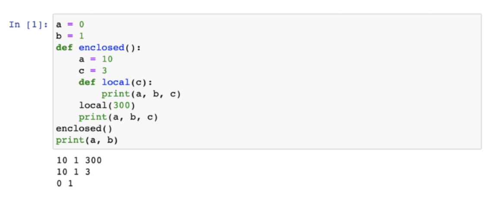

# Python

[TOC]

## 1. Python Basic - (1)

### 파이썬 기능

`저장  `: dust = 60  dust에 60을 저장한다.

같다 : dust == 60

무엇을 저장하는가? 숫자, 글자, 참/거짓

58 == int  vs  '58' == string

`variable` :  박스 하나

`list` : 박스 여러개의 묶음

`dictionary` : `list`에 이름을 붙인 것

조건

`if` : 만약 뒤의 식이 True 이면 아래 문장 실행

`elif` : if가 아닐 때, 다른 if

`else` : if 과 elif가 모두 아닐 때, 실행


반복

* `while` : True인 동안 계속해서 반복해서 실행 
  * 반드시 종료조건이 필요

```python
n = 0
while n < 3: # n이 3
    print(dust[n])
    n = n + 1
```


* `for` : 정해진 범위 안에서 반복해서 실행
  * 종료조건이 필요없음

```python
for var in range:
    pass
```


### Python 함수

1) Built in Funcion (내장함수 )

2. non-built in Function 


### Module

#### random

`random.choice()`

`random.sample(range, how many)`


### API

**Json(JavaScript Object Notation)**

* 데이터만을 주고 받기 위한 표기법

* 파이썬의 Dicrionary 와 list구조로 쉽게 변환하여 사용 할 수 있다.


### pip

* python module 설치 명령

  

### request (Third-Party Library)

* python을 통해서 요청 보내는 방법

* `get()` : url에 조회 요청을 보냄


## 2. Python Basic - (2)

**Program :** 일련의 명령어의 모음

언어 : 자신의 **생각을 나타내고 전달**하기 위해 사용하는 체계

### 컴퓨터 프로그래밍언어

선언전 지식 : 사실에 대한 내용

명령적 지식 : How-to

'' = '' : 할당  

'' == '' : 같다.

객체: 숫자, 문자, 클래스 등 값을 가지고 있는 모든 것.


`type()` : 변수에 할당된 값의 타입

`id()` : 문자의 id

숫자 + 숫자 (덧셈)

문자 + 문자 (문자를 연결)

문자 * 숫자 (문자를 여러번 작성)

**변수할당** : 같은 값을 동시에 할당할 수 있음

다른값을 동시에 할당 할 수 있음

에러의 특정 

### 식별자(Identifiers)	

* 변수의 이름을 어떻게 지을 수 있을 까?
* 영문 알파벳, 언더스코어, 숫자
* 길이제한 x 대소문자 구별 예약어 x

```python
RedApple
red_apple <- snake case
```

내장 함수나 모듈 등의 이름으로도 만들면 안됨. 기존의 이름에 다른 값을 할당하게 되므로 더 


### 사용자 입력

`input([prompt])` 

주석 코드에 대한 설명(컴퓨터는 실행 x)


### 파이썬 자료형

* `Boolean Type` : True/False  리스트, set 등이 비어있으면 False
  * `bool()` : T인지 F인지 반환 bool([])=> false bool([0]) =>t

* `None` : 값이 없음을 표현하기 위함

* `int` : 모든 정수타입

  * 진수 표현 
    * 2진수 0b, 8진수 0o, 16진수 0x

  * Floating point rounding error
    * 부동 소수점에서 실수 연산 과정에서 발생 가능 

* `String Type` : 모든 문자는 str type

  * 작은 따옴표나 큰 따옴표를 활용하여 표기

  * Immutable : 어떠한 값이 불변하다. 할당이 불가능 하다.
  * Iterable : 반복 가능하다.

* Escape Sequence

  * \n \t \\r \0 \\\ \\' \\"

* String Interpolation

  * %-String - 거의 대부분의 

  * .format()

  * f-String

### Container

컨테이너: 여러개의 값을 담을 수 있는 것(객체), 서로 다른 자료형을 저장 할 수 있음

순서가 있는 데이터 (Ordered) vs 순서가 없는 데이터 (Unordered)

시퀀스형: 리스트, 튜플, 레인지

비시퀀스형: 세트, 딕셔너리

### List

* 숫서를 가지는 0개 이상의 객체를 참조하는 자료형 
  * 생성된 이후 내용 변경이 가능

* list = []
* list = list()


tuple: 수정 불가능

tuple 생성 주의사항

단일 항목의 경우

하나의 항목으로 구성된 튜플은 생성시 값뒤에 쉼표를 붙여야함

() 혹은 tuple()을 통해 생성 

튜플은 일반적으로 파이썬 내부에서 활용

추후 함수에서 복수의 값을 반환 할 때, 사용 

range(): 숫자의 시퀀스를 나타내기 위해 사용

range(n,m,s)


패킹, 언패킹 연산자 

패킹: 대입문의 좌변 변수에 위치

우변의 객체 수가 좌변의 변수 수보다 많을 경우 객체를 순서대로 대입

언패킹:

set: 수학에서 집합과 같은 구조를 가짐

중복없이 순서가 없는 자료 구조 => 인덱스 접근 불가능

set() = 빈셋 생성

{} = 빈 딕셔너리 생성

아래의 리스트레서 고유한 지역을 등장한 순서대로 출력하시오.

=> set을 사용하면 순서가 사라짐

딕셔너리: 순서 없이 키-값쌍으로 이뤄진 객체를 참조하는 자료형

= {} or dict()

key에는 list 불가능하다 

key를 통해서 Value로 접근 따라서 key는 중복 및 변경이 불가능하다.

value는 모든 값으로 설정 가능 

### 형변환

암시적 : 사용자 의도x, 파이썬이 내부적으로 자료형을 변환하는 경우 

ex) bool, Numeric Type

명시적 : str, float => int


### 컨테이너 형 변환

딕셔너리, 레인지로는 변환 불가능 하다.

dictionary를 변환하는 경우 key만 나온다


### 연산자

#### 기타 : 인덱싱(Indexing)

* 시퀀스의 특정 인덱스 값에 접근
  *  해당 인덱스가 없는 경우 IndexError

#### 기타 : 슬라이싱

* 시퀀스를 특정 단위로 슬라이싱

```python
[1, 2, 3, 5][1:4] # 뒤에는 미포함
array[a:b:c] => a 부터 b 전까지 c씩 띄워서
```


프로그램 구성 단위

* 표현식
  * 새로운 데이터 값을 생성하거나 계산하는 코드 조각

* 문장
* 함수 
  * 특정 명령을 수행하는 묶음
* 모듈
  * 다른 프로그램에서 불러와 사용하기 위한 것
* 패키지
  * 프로그램과 모듈 묶음
* 라이브러리
  * 패키지 모음


#### 정리

숫자 / boolean / None

String = 문자열의 나열

[list] = 요소들의 시퀀스

(tuple) = 변경 불가능

{set} = 중복 불가능

{dictionary} = key를 통해서 value에 접근 key:중복 불가능, 변경 불가능 value 

### 조건문

#### if, elif, else

#### 조건 표현식 (list.comprehension)

```python
value = num if num >= 0 else -num
# if num >=0 : expression
# value = num : 참일 경우
# -num : 거짓일 경우
```


### 반복문

#### for (통 만들기!)

* for반복 가능한 애들을 꺼내준다 

#### while (조건 생각!)

* 조건이 참인 동안 실행 '종료조건(거짓)'


#### dictionary 순회

```python
grades = {'kim': 80, 'lee':100}

for key in grades:
    print(key, grades[key])
for key in grades.keys():
    print(key, grades[key])
for value in grades.values():
    print(value)
for key, value in grades.items():
    print(key, value)
```


#### enumerate 순회

```python
members = ['민수', '영희', '철수']

print(list(enumerate(members)))

for idx, value in enumerate(members):
    print(idx, value)
```


List Conprehension 실습

```python
cubic_list = []
for number in range(1,4):
    cubic_list.append(number ** 3)

cubic_list                    
                    
```


#### 반복문 제어 

`break` : 반복문을 즉시 종료시킨다.

```python
n = 0 
while True:
    if n ==1:
   		break
    print(n)
    n += 1

for i in range(10):
    if i > 1:
        print('0과 1만 필요해!')
       	break
       
```

`continue` : 이후의 코드블록은 수행하지 않고, 다음 반복을 수행

`pass` : 아무것도 하지 않음.

* 그냥 자리 패우는 용도로 사용

`else` : 끝까지 반복문을 실행한 이후에 else문 실행ㄴ

```python
for char in 'apple':
    if char == 'b':
        print('b!')
        break 		# b가 없기 때문에 break를 만나지 못한다 --> else로 간다.
else:
    print('b가 없습니다.')
    
for char in 'banana':
    if char == 'b':
	    print('b!')
        break		# break를 통해 반복문이 중단 되었기 때문에 else가 실행 되지 않는다.
else:
    print('b가 없습니다.')
```


### [] vs list()

* 둘 중에 성능은 항상 대괄호 방식이 더 좋음
* 특히 list() 방식은 C 언어 방식
* 최우선은 가독성!! 성능보다 가독성!

```python
list_a = []
for i in range(3):
    list_a.append(i)
```

`"Simple is better than complex"

"Keep it simple, stipid"

#### 성능 (loop & map & list comp)

* for -> 버전이 올라가면서 성능이 향상되었다.


## 3. 함수 (function)

* `추상화 (Abstraction)` : 복잡한 내용을 모르더라도 사용할 수 있도록(블랙박스)
  * 재사용성, 가독성, 생산성 up

* `분해 (Decomposition)`

  

### 함수의 정의

* `함수` : 특정한 기능을 하는 코드의 조각 (묶음)
  * 매번 다시 작성하지 않고 필요 시에만 호출하여 간편히 사용.


### 사용자 정의 함수

* 구현되어 있는 함수가 없는 경우 사용자가 직접 함수를 작성가능

```python
def function_name(parameter):
    # code block
    return output
```

**기본구조**

* 선언과 호출, 입력, 문서화, 범위, 결과값

### 함수의 결과값(Output)

=> 모든 함수는 반드시 하나의 `객체(object)` 반환

* void function
  * 명시적인 **return값이 없는 경우** None을 반환하고 종료

* value returning function
  * **return값을 반환**하고 종료 => return 값은 1개
    * 두 개의 값 리턴 -> tuple 하나

* return vs print

  * `return` : 함수 안에서만 사용되는 키워드

  * `print` : 출력을 위해 사용되는 함수 (개발자가 값을 보기 위해)

    

### 함수의 입력(Input)

* `Parameter` : 함수를 실행할 때, 함수 내부에서 사용되는 식별자

* `Argument` : 함수를 호출 할 때 넣어주는 값
  * 함수 호출 시 함수의 parameter르르 통해 전달 되는 값
  * `필수 Argument` : 반드시 전달 되어야 하는 argument
  * `선택 Argument` : 값을 전달하지 않아도 되는 경우는 기본 값을 전달

```python
def function(ham ):	# parameter : x
    return ham

function('spam')	# argument : 'spam'
```

* 각각 바인딩 
* `Positional Argument` : 기본적으로 함수 호출 시 Argument는 위치에 따라 함수 내에 전달
* `Keyword Argument` : 직접 변수의 이름으로 특정 Argument를 전달할 수 있음

```python
def add(x,y):
    return x + y

add(1,2) 		# 위치 - 내부에서 바인딩 x = 1; y = 2
add(y=2, x=1) 	# 키워드 - 직접 x와 y의 값을 각각지정
add(x=1, 2)		# SyntaxError: positional argument 'follows' keyword argument
				# 키워드 인자를 사용하는 순간 위치로 바인딩 불가능
add(1, y=2)		# 위치 지정 먼저 하고 키워드 사용하면 가능하다.
```

* `Default Arguments Values (Optional)` : 기본값 지정, 함수 호출 시 argument 값을 설정하지 않도록 함 

* `Positional Arguments Packing / Unpacking` 연산자(*) (묶겠다~)

  * 여러개의 Positional Argument를 하나의 필수 parameter(tuple)로 받아서 사용 (*args)
  * input data를 tuple형식으로 묶음
  * 뒤에 있으면 좋지만 항상 맨 뒤로 갈 필요는 없다 (함수를 어떻게 정의하느냐에 따라 다르다)

* `Keyword Arguments Packing/  Unpacking` 연산자 (**)

  * 딕셔너리로 묶여서 처리가 된다. (key는 식별자기 때문에 "" 넣지 않음)

  * 항상 맨 마지막에 정의

    *  if not, keyword argument 사용시 **kwargs 변수로 인식됨

      

### 함수의 범위(Scope)

* 변수는 각자의 Life Cycle이 존재

* 함수는 코드 내부에 local scope를 생성 => 블랙박스는 고유의 공간을 가지고 있다.

* 그외의 공간은 global scope이다.

  * `built-in scope` : 파이썬이 실행된 이후부터 영원히 유지

  * `global scope` : 모듈이 호출된 시점 이후 혹은 인터프리터가 끝날 때 까지 유지

  * `local scope` : 함수가 호출될 때 생성, 함수가 종료되면 삭제

* 이름 검색 규칙

  * `Built-in` : 내장 함수, Python 전체
  * `Global` : file 내
  * `Enclosed` : 
  * `Local` : 함수 블럭 내에서만 

  지역적 --> 전역 순 (LEGB)



* `global` : Local scope에서 global 변수 값의 변경

  * global var 사용
    * 하지만 logic안의 값을 바꾸기 때문에 함수를 활용하여 값을 리턴 받고 바꾸자.
  * `globals()`, `locals()`

* `nonlocal` : enclosed scope의 변수 값 변경

  

* 해당 scope에 변수가 없는 경우 LEGB rule에 의해 이름을 검색함
  * 하지만 변수의 수정은 불가능하다.
  * 따라서 global, nonlocal 사용 

```python
numbers = [1,2,3,4] 	# 메모리 주소

def new():
    numbers[0] = 100 	# 새로 만든 변수를 바꾸는 것이 아닌 numbers 메모리 주소에 있는 것을 바꿈

new()
print(numbers)
```


### 함수의 문서화 (Doc-String)

* 함수나 클래스의 설명

* Naming Convention

  

###  함수의 응용

`map(function, iterable)`: iterable한 객체를 하나하나 모두 function을 적용해서 map 객체를 반환

`filter(function, iterable)` : 결과가 True인 것들만 filter object로 반환

`zip(*iterables)` : 복수의 iterable을 모아 튜플을 원소로 하는 zip object를 반환

`lambda [parameter]: 표현식` : 결과값을 반환하는 함수

`재귀 함수(recursive function)`


## 4. 모듈과 패키지 

* `module` : 특정기능을 하는 코드를 python_file(.py) 단위로 작성한 것
* `package` : 특정 기능과 관련된 여러 모듈의 집합

```python
import module
from module import function

from package import module
from package.module imrpot function
```


### 파이썬 표준 라이브러리(Python Standard Library, PSL)

* 파이썬에 기본적으로 설치된 모듈과 내장 함수 

* 파이썬 패키지 관리자(pip) 명령어

  * `pip install` : 패키지 설치
    * PyPi라는 곳에 배포된 패키지들을 설치
  * `pip uninstall` : 패키지 제거
  * `pip list` : 현재 설치되어 있는 패키지 확인
  * `pip freeze` : 현재 설치되어 있는 패키지 버전 매핑

```bash
$ pip freeze > requirement.txt
$ pip install -r requirement.txt
```


### 사용자 모듈과 패키지

* 사용자가 스스로 모듈 만들어 사용

* 패키지는 여러 모듈/하위 패키지로 구조화

  * 활용 예시 : package.module

* 모든 폴더에는 `__init__.py `를 만들어 패키지로 인식


### 가상환경

* 파이썬 표준 라이브러리가 아닌 외부 패키지와 모듈을 사용하는 경우
  * 프로젝트 별로 다른 환경에서 작업할 수 있도록 도와주는 기능
  * 주로 1프로젝트당 1가상환경
  
* Python 3.5부터 가상환경 활성화 가능 

```bash
$ python -m venv venv
$ source venv/Scripts/activate
```


