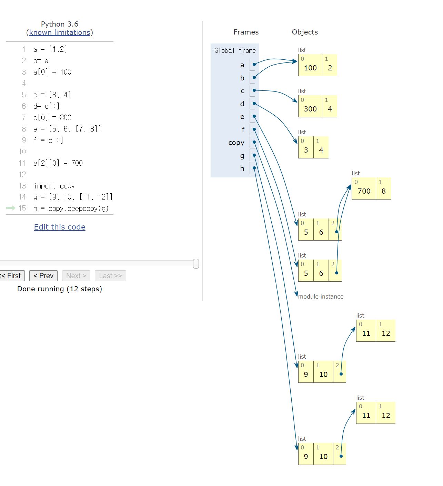
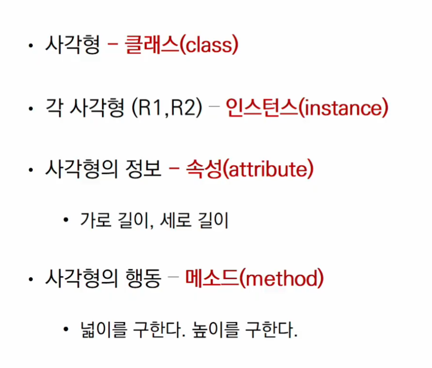

# Python

[TOC]

## 1. Python Basic - (1)

### 파이썬 기능

`저장  `: dust = 60  dust에 60을 저장한다.

같다 : dust == 60

무엇을 저장하는가? 숫자, 글자, 참/거짓

58 == int  vs  '58' == string

`variable` :  박스 하나

`list` : 박스 여러개의 묶음

`dictionary` : `list`에 이름을 붙인 것

조건

`if` : 만약 뒤의 식이 True 이면 아래 문장 실행

`elif` : if가 아닐 때, 다른 if

`else` : if 과 elif가 모두 아닐 때, 실행


반복

* `while` : True인 동안 계속해서 반복해서 실행 
  * 반드시 종료조건이 필요

```python
n = 0
while n < 3: # n이 3
    print(dust[n])
    n = n + 1
```


* `for` : 정해진 범위 안에서 반복해서 실행
  * 종료조건이 필요없음

```python
for var in range:
    pass
```


### Python 함수

1) Built in Funcion (내장함수 )

2. non-built in Function 


### Module

#### random

`random.choice()`

`random.sample(range, how many)`


### API

**Json(JavaScript Object Notation)**

* 데이터만을 주고 받기 위한 표기법

* 파이썬의 Dicrionary 와 list구조로 쉽게 변환하여 사용 할 수 있다.


### pip

* python module 설치 명령

  

### request (Third-Party Library)

* python을 통해서 요청 보내는 방법

* `get()` : url에 조회 요청을 보냄


## 2. Python Basic - (2)

**Program :** 일련의 명령어의 모음

언어 : 자신의 **생각을 나타내고 전달**하기 위해 사용하는 체계

### 컴퓨터 프로그래밍언어

선언전 지식 : 사실에 대한 내용

명령적 지식 : How-to

'' = '' : 할당  

'' == '' : 같다.

객체: 숫자, 문자, 클래스 등 값을 가지고 있는 모든 것.


`type()` : 변수에 할당된 값의 타입

`id()` : 문자의 id

숫자 + 숫자 (덧셈)

문자 + 문자 (문자를 연결)

문자 * 숫자 (문자를 여러번 작성)

**변수할당** : 같은 값을 동시에 할당할 수 있음

다른값을 동시에 할당 할 수 있음

에러의 특정 

### 식별자(Identifiers)	

* 변수의 이름을 어떻게 지을 수 있을 까?
* 영문 알파벳, 언더스코어, 숫자
* 길이제한 x 대소문자 구별 예약어 x

```python
RedApple
red_apple <- snake case
```

내장 함수나 모듈 등의 이름으로도 만들면 안됨. 기존의 이름에 다른 값을 할당하게 되므로 더 


### 사용자 입력

`input([prompt])` 

주석 코드에 대한 설명(컴퓨터는 실행 x)


### 파이썬 자료형

* `Boolean Type` : True/False  리스트, set 등이 비어있으면 False
  * `bool()` : T인지 F인지 반환 bool([])=> false bool([0]) =>t

* `None` : 값이 없음을 표현하기 위함

* `int` : 모든 정수타입

  * 진수 표현 
    * 2진수 0b, 8진수 0o, 16진수 0x

  * Floating point rounding error
    * 부동 소수점에서 실수 연산 과정에서 발생 가능 

* `String Type` : 모든 문자는 str type

  * 작은 따옴표나 큰 따옴표를 활용하여 표기

  * Immutable : 어떠한 값이 불변하다. 할당이 불가능 하다.
  * Iterable : 반복 가능하다.

* Escape Sequence

  * \n \t \\r \0 \\\ \\' \\"

* String Interpolation

  * %-String - 거의 대부분의 

  * .format()

  * f-String

### Container

컨테이너: 여러개의 값을 담을 수 있는 것(객체), 서로 다른 자료형을 저장 할 수 있음

순서가 있는 데이터 (Ordered) vs 순서가 없는 데이터 (Unordered)

시퀀스형: 리스트, 튜플, 레인지

비시퀀스형: 세트, 딕셔너리

### List

* 숫서를 가지는 0개 이상의 객체를 참조하는 자료형 
  * 생성된 이후 내용 변경이 가능

* list = []
* list = list()


tuple: 수정 불가능

tuple 생성 주의사항

단일 항목의 경우

하나의 항목으로 구성된 튜플은 생성시 값뒤에 쉼표를 붙여야함

() 혹은 tuple()을 통해 생성 

튜플은 일반적으로 파이썬 내부에서 활용

추후 함수에서 복수의 값을 반환 할 때, 사용 

range(): 숫자의 시퀀스를 나타내기 위해 사용

range(n,m,s)


패킹, 언패킹 연산자 

패킹: 대입문의 좌변 변수에 위치

우변의 객체 수가 좌변의 변수 수보다 많을 경우 객체를 순서대로 대입

언패킹:

set: 수학에서 집합과 같은 구조를 가짐

중복없이 순서가 없는 자료 구조 => 인덱스 접근 불가능

set() = 빈셋 생성

{} = 빈 딕셔너리 생성

아래의 리스트레서 고유한 지역을 등장한 순서대로 출력하시오.

=> set을 사용하면 순서가 사라짐

딕셔너리: 순서 없이 키-값쌍으로 이뤄진 객체를 참조하는 자료형

= {} or dict()

key에는 list 불가능하다 

key를 통해서 Value로 접근 따라서 key는 중복 및 변경이 불가능하다.

value는 모든 값으로 설정 가능 

### 형변환

암시적 : 사용자 의도x, 파이썬이 내부적으로 자료형을 변환하는 경우 

ex) bool, Numeric Type

명시적 : str, float => int


### 컨테이너 형 변환

딕셔너리, 레인지로는 변환 불가능 하다.

dictionary를 변환하는 경우 key만 나온다


### 연산자

#### 기타 : 인덱싱(Indexing)

* 시퀀스의 특정 인덱스 값에 접근
  *  해당 인덱스가 없는 경우 IndexError

#### 기타 : 슬라이싱

* 시퀀스를 특정 단위로 슬라이싱

```python
[1, 2, 3, 5][1:4] # 뒤에는 미포함
array[a:b:c] => a 부터 b 전까지 c씩 띄워서
```


프로그램 구성 단위

* 표현식
  * 새로운 데이터 값을 생성하거나 계산하는 코드 조각

* 문장
* 함수 
  * 특정 명령을 수행하는 묶음
* 모듈
  * 다른 프로그램에서 불러와 사용하기 위한 것
* 패키지
  * 프로그램과 모듈 묶음
* 라이브러리
  * 패키지 모음


#### 정리

숫자 / boolean / None

String = 문자열의 나열

[list] = 요소들의 시퀀스

(tuple) = 변경 불가능

{set} = 중복 불가능

{dictionary} = key를 통해서 value에 접근 key:중복 불가능, 변경 불가능 value 

### 조건문

#### if, elif, else

#### 조건 표현식 (list.comprehension)

```python
value = num if num >= 0 else -num
# if num >=0 : expression
# value = num : 참일 경우
# -num : 거짓일 경우
```


### 반복문

#### for (통 만들기!)

* for반복 가능한 애들을 꺼내준다 

#### while (조건 생각!)

* 조건이 참인 동안 실행 '종료조건(거짓)'


#### dictionary 순회

```python
grades = {'kim': 80, 'lee':100}

for key in grades:
    print(key, grades[key])
for key in grades.keys():
    print(key, grades[key])
for value in grades.values():
    print(value)
for key, value in grades.items():
    print(key, value)
```


#### enumerate 순회

```python
members = ['민수', '영희', '철수']

print(list(enumerate(members)))

for idx, value in enumerate(members):
    print(idx, value)
```


List Conprehension 실습

```python
cubic_list = []
for number in range(1,4):
    cubic_list.append(number ** 3)

cubic_list                    
                    
```


#### 반복문 제어 

`break` : 반복문을 즉시 종료시킨다.

```python
n = 0 
while True:
    if n ==1:
   		break
    print(n)
    n += 1

for i in range(10):
    if i > 1:
        print('0과 1만 필요해!')
       	break
       
```

`continue` : 이후의 코드블록은 수행하지 않고, 다음 반복을 수행

`pass` : 아무것도 하지 않음.

* 그냥 자리 패우는 용도로 사용

`else` : 끝까지 반복문을 실행한 이후에 else문 실행ㄴ

```python
for char in 'apple':
    if char == 'b':
        print('b!')
        break 		# b가 없기 때문에 break를 만나지 못한다 --> else로 간다.
else:
    print('b가 없습니다.')
    
for char in 'banana':
    if char == 'b':
	    print('b!')
        break		# break를 통해 반복문이 중단 되었기 때문에 else가 실행 되지 않는다.
else:
    print('b가 없습니다.')
```


### [] vs list()

* 둘 중에 성능은 항상 대괄호 방식이 더 좋음
* 특히 list() 방식은 C 언어 방식
* 최우선은 가독성!! 성능보다 가독성!

```python
list_a = []
for i in range(3):
    list_a.append(i)
```

`"Simple is better than complex"

"Keep it simple, stipid"

#### 성능 (loop & map & list comp)

* for -> 버전이 올라가면서 성능이 향상되었다.


## 3. 함수 (function)

* `추상화 (Abstraction)` : 복잡한 내용을 모르더라도 사용할 수 있도록(블랙박스)
  * 재사용성, 가독성, 생산성 up

* `분해 (Decomposition)`

  

### 함수의 정의

* `함수` : 특정한 기능을 하는 코드의 조각 (묶음)
  * 매번 다시 작성하지 않고 필요 시에만 호출하여 간편히 사용.


### 사용자 정의 함수

* 구현되어 있는 함수가 없는 경우 사용자가 직접 함수를 작성가능

```python
def function_name(parameter):
    # code block
    return output
```

**기본구조**

* 선언과 호출, 입력, 문서화, 범위, 결과값

### 함수의 결과값(Output)

=> 모든 함수는 반드시 하나의 `객체(object)` 반환

* void function
  * 명시적인 **return값이 없는 경우** None을 반환하고 종료

* value returning function
  * **return값을 반환**하고 종료 => return 값은 1개
    * 두 개의 값 리턴 -> tuple 하나

* return vs print

  * `return` : 함수 안에서만 사용되는 키워드

  * `print` : 출력을 위해 사용되는 함수 (개발자가 값을 보기 위해)

    

### 함수의 입력(Input)

* `Parameter` : 함수를 실행할 때, 함수 내부에서 사용되는 식별자

* `Argument` : 함수를 호출 할 때 넣어주는 값
  * 함수 호출 시 함수의 parameter르르 통해 전달 되는 값
  * `필수 Argument` : 반드시 전달 되어야 하는 argument
  * `선택 Argument` : 값을 전달하지 않아도 되는 경우는 기본 값을 전달

```python
def function(ham ):	# parameter : x
    return ham

function('spam')	# argument : 'spam'
```

* 각각 바인딩 
* `Positional Argument` : 기본적으로 함수 호출 시 Argument는 위치에 따라 함수 내에 전달
* `Keyword Argument` : 직접 변수의 이름으로 특정 Argument를 전달할 수 있음

```python
def add(x,y):
    return x + y

add(1,2) 		# 위치 - 내부에서 바인딩 x = 1; y = 2
add(y=2, x=1) 	# 키워드 - 직접 x와 y의 값을 각각지정
add(x=1, 2)		# SyntaxError: positional argument 'follows' keyword argument
				# 키워드 인자를 사용하는 순간 위치로 바인딩 불가능
add(1, y=2)		# 위치 지정 먼저 하고 키워드 사용하면 가능하다.
```

* `Default Arguments Values (Optional)` : 기본값 지정, 함수 호출 시 argument 값을 설정하지 않도록 함 

* `Positional Arguments Packing / Unpacking` 연산자(*) (묶겠다~)

  * 여러개의 Positional Argument를 하나의 필수 parameter(tuple)로 받아서 사용 (*args)
  * input data를 tuple형식으로 묶음
  * 뒤에 있으면 좋지만 항상 맨 뒤로 갈 필요는 없다 (함수를 어떻게 정의하느냐에 따라 다르다)

* `Keyword Arguments Packing/  Unpacking` 연산자 (**)

  * 딕셔너리로 묶여서 처리가 된다. (key는 식별자기 때문에 "" 넣지 않음)

  * 항상 맨 마지막에 정의

    *  if not, keyword argument 사용시 **kwargs 변수로 인식됨

      

### 함수의 범위(Scope)

* 변수는 각자의 Life Cycle이 존재

* 함수는 코드 내부에 local scope를 생성 => 블랙박스는 고유의 공간을 가지고 있다.

* 그외의 공간은 global scope이다.

  * `built-in scope` : 파이썬이 실행된 이후부터 영원히 유지

  * `global scope` : 모듈이 호출된 시점 이후 혹은 인터프리터가 끝날 때 까지 유지

  * `local scope` : 함수가 호출될 때 생성, 함수가 종료되면 삭제

* 이름 검색 규칙

  * `Built-in` : 내장 함수, Python 전체
  * `Global` : file 내
  * `Enclosed` : 
  * `Local` : 함수 블럭 내에서만 

  지역적 --> 전역 순 (LEGB)


* `global` : Local scope에서 global 변수 값의 변경

  * global var 사용
    * 하지만 logic안의 값을 바꾸기 때문에 함수를 활용하여 값을 리턴 받고 바꾸자.
  * `globals()`, `locals()`

* `nonlocal` : enclosed scope의 변수 값 변경

  

* 해당 scope에 변수가 없는 경우 LEGB rule에 의해 이름을 검색함
  * 하지만 변수의 수정은 불가능하다.
  * 따라서 global, nonlocal 사용 

```python
numbers = [1,2,3,4] 	# 메모리 주소

def new():
    numbers[0] = 100 	# 새로 만든 변수를 바꾸는 것이 아닌 numbers 메모리 주소에 있는 것을 바꿈

new()
print(numbers)
```


### 함수의 문서화 (Doc-String)

* 함수나 클래스의 설명

* Naming Convention

  

###  함수의 응용

`map(function, iterable)`: iterable한 객체를 하나하나 모두 function을 적용해서 map 객체를 반환

`filter(function, iterable)` : 결과가 True인 것들만 filter object로 반환

`zip(*iterables)` : 복수의 iterable을 모아 튜플을 원소로 하는 zip object를 반환

`lambda [parameter]: 표현식` : 결과값을 반환하는 함수

`재귀 함수(recursive function)`


## 4. 모듈과 패키지 

* `module` : 특정기능을 하는 코드를 python_file(.py) 단위로 작성한 것
* `package` : 특정 기능과 관련된 여러 모듈의 집합

```python
import module
from module import function

from package import module
from package.module imrpot function
```


### 파이썬 표준 라이브러리(Python Standard Library, PSL)

* 파이썬에 기본적으로 설치된 모듈과 내장 함수 

* 파이썬 패키지 관리자(pip) 명령어

  * `pip install` : 패키지 설치
    * PyPi라는 곳에 배포된 패키지들을 설치
  * `pip uninstall` : 패키지 제거
  * `pip list` : 현재 설치되어 있는 패키지 확인
  * `pip freeze` : 현재 설치되어 있는 패키지 버전 매핑

```bash
$ pip freeze > requirement.txt
$ pip install -r requirement.txt
```


### 사용자 모듈과 패키지

* 사용자가 스스로 모듈 만들어 사용

* 패키지는 여러 모듈/하위 패키지로 구조화

  * 활용 예시 : package.module

* 모든 폴더에는 `__init__.py `를 만들어 패키지로 인식


### 가상환경

* 파이썬 표준 라이브러리가 아닌 외부 패키지와 모듈을 사용하는 경우
  * 프로젝트 별로 다른 환경에서 작업할 수 있도록 도와주는 기능
  * 주로 1프로젝트당 1가상환경
  
* Python 3.5부터 가상환경 활성화 가능 

```bash
$ python -m venv venv
$ source venv/Scripts/activate
```


## 5. 데이터 구조 및 활용

### Method (s.v)

#### String (immutable)

* 문자열 검증 메소드

  * `s.find(x)` : x의 첫번 쨰 위치를 반환, 없으면 -1을 반환

  ```python
  'apple'.find('p')
  ```

  * `s.index(x`)` :  x의 첫번 쨰 위치를 반환, 없으면 오류 발생

  * `s.isalpha()` : 알파벳 문자여부

    * `is`는 결과값이 boolean (T/F)

  * `s.isupper()` : 대문자 여부

  * `s.islower()` : 소문자 여부

  * `s.istitle()` :타이틀 형식 여부

    * 단어의 첫글자만 대문자

  * `isdecimal()`: 

  * `isdigit()` 

  * `isnumeric()`

    

* 문자열 변경 메소드

  * `s.replace(old,new, [횟수])` : 문자열 바꿔서 반환
  * `s.strip([chars])` : 특정 문자를 제거 (양방향)
    * `s.lstrip()` : 왼쪽에 있는 것 제거
    * `s.rstrip()` : 오른쪽에 있는 것 제거 
  * `s.split(sep=None, maxsplit = -1)`: 문자열을 특정한 단위로 나눠 (구분자 사용) 리스트로 반환
  * `'seperator(구분자)'join([iterable])` 구분자로 iterable을 합침
    * iterable에 문자열이 아닌 값이 있으면 Error 발생 (String의 메서드)

  ```python
  str = ['1','2','3']
  print(' ',join(str))
  
  numbers=[1,2,3]
  print(' ',join(map(str,numbers)))
  ```

  * `s.capitalize()` :

  * `s.title()` : `'`  어퍼스트로피 뒤에도 대문자

  * `s.upper()` :

  * `s.lower()` :

  * `s.swapcase()` : 소문자와 대문자 바꿈

    

#### List = []

* 순서를 가지는 0개 이상의 객체를 참조하는 자료형
  * 리스트 요소를 변경시키는 것 : mutable
  * `L.append(x)` : 마지막에 x 추가
  * `L.insert(i, x)` : i인덱스에 x 삽입
  * `L.remove(x)` : 리스트 가장 왼쪽에 있는 항목 x를 제거
  * `L.pop()`: 리스트 가장 마지막을 반환 후 제거
  * `L.pop(idx)` : 인덱스 idx에 있는 항목을 반환 후 제거
  * `L.extend(iterable)` : 리스트에 iterable 항목을 추가함 (두 리스트를 합친다. 둘다 리스트 형태여야함)
  * `L.index(x, start, end)` : 값을 찾아서 인덱스를 반환
  * `L.reverse()` : 순서를 반대로 뒤집는다. (원본 자체의 순서가 바뀜)
  * `L.sort()` : 원본 리스트를 정렬한다
    * `sorted(L) `: 정렬된 리스트르 반환한다.
  * `L.count(x)` : 원하는 값의 개수를 반환.


#### Tuple = ()

* 순서를 가지는 0개 이상의 객체를 참조하는 자료형
* 값에 영향을 미치지 않는 메소드만을 지원
  * 


#### Set = {}

* 순서없이 0개 이상의 해시 가능한 객체를 참조하는 자료형 (해시가능한 객체 = 불변 자료형)
  * `s.copy()` :
  * `s.add(elem)` : 셋에 값을 추가
  * `s.update(*others)` : 셋에 한번에 여러가지 값을 추가
  * `s.remove(elem)` : 셋에서 삭제하고, 없으면 KeyError
  * `s.discard(elem)` : 셋에서 삭제하고 없어도 에러가 발생하지 않음
  * `s.pop()` : 임의의 원소를 제거해 반환


#### Dictionary

* 순서 없이 키-값 쌍으로 이뤄진 객체를 참조하는 자료형
* key = 해시가능한 불변 자료형만 가능, values = 어떠한 형태든 관계 없음
  * `d.clear()`
  * `d.copy()`
  * `d.keys()`
  * `d.values()`
  * `d.items()`
  * `d.get(key [,default])` : 키를 통해 value를 가져옴, 에러 발생 x
  * `d.pop(key[,default])` : key가 딕셔너리에 있으면 제거하고 해당 값을 반환
    * 해당 값이 딕셔너리 내에 없을 경우 default 반환
    * default값이 없을 경우 keyError
  * `d.update(key, value)` : 값을 제공하는 key, value로 덮어씁니다.


### 얕은 복사와 깊은 복사 (Shallow Copy & Deep Copy)

#### 할당(assignment)

* 대입 연산자(=) : 리스트 복사 확인하기

  * 해당 객체에 대한 객체 참조를 복사

  * 두개의 리스트가 모두 바뀐다. 리스트 복사 확인하기

    * 해당 주소의 일부 값을 변경하는 경우 이를 참조하는 모든 변수에 영향

      

#### 얕은 복사(shallow copy)

```python
#슬라이싱 or list()
original_list = [1, 2, 3]
copy_list = original_list[:]

copy_list = list(original_list)
```

얕은 복사(Shallow Copy) **주의사항**

* 복사하는 리스트의 원소가 주소를 참조하는 경우
  * 리스트에는 주소가 저장되어있다. (슬라이싱 or list())

```python
# 2차원일 때
a = [1, 2, ['a','b']]
b = a[:]

print(a, b)
b[2][0] = 0
print(a, b)
```


#### 깊은 복사 (deep copy)

* 주소를 그대로 참조 하지 않고 값만 복사해서 저장한다.

```python
import copy
a = [1, 2, ['a', 'b']]
b = copy.deepcopy(a)
print(a,b)
b[2][0] = 0
print(a, b)
```



### 디버깅

*  branches : 
  * 모든 조건을 커버하는가?
* for loops : 
  * 원하는 횟수만큼 반복되는가?
  * 반복문 내 값 변경이 원하는대로 이루어지고 있는가?(결과)
* while loops : for + 종료조건이 제대로 설정 되었는가?
* function : 호출, 파라미터, 결과 // type


* print함수 활용
* 개발환경 등에서 제공하는 기능 활용
* Python Tutor 활용 (단순 파이썬 기능인 경우)
* 에러 메시지가 발생하는 경우 
  * 해당하는 위치를 찾아 메시지를 해결

* 로직 에러가 발생하는 경우 

  * 명시적인 에러 메시지 없이 예상과 다른 결과가 나온 경우

  

### 에러와 예외

#### 문법에러

* invalid syntax : 안됨

* assign to literal : 문자에 할당
* `EOL (End Of Line)` : 문장이 제대로 끝나지 않았다.
* `EOF (End Of File)` : 파일이 제대로 끝나지 않았다.


#### 예외

*  실행 도중 예상치 못한 상황을 맞이하면, 프로그램 실행을 멈춤
* `ZeroDivisionError` : 0으로 나누고자 할 때,
* `NameError` : namespace 상에 이름이 없는 경우 (오타)

* `TypeError` : 타입 불일치, argument 누락
* `ValueError` :타입은 올바르나 적절하지 않거나 없는 경우
* `IndexError` : 인덱스가 존재하지 않거나 범위를 벗어나는 경우
* `KeyErroe` : 키가 없는 경우
* `ModuleNotFoundError` : 잘못된 모듈을 불러온 경우
* `ImportError` : 모듈은 있으나 잘못된 함수 or aptjem qnffjdhkTdmf Eo, 
* `KeyboardInterrupt` : 키보드로 임의로 멈춤

* `IndentationError` : 잘못된 Indentation (띄워쓰기 or tab)


#### 예외 처리

* 알고리즘 문제보다는 실질적인 개발에 사용된다.

* if else: 의 경우 프로그램이 멈추지만 try, except의 경우에는 계속 진행된다.

  * `try` : 먼저함

  * `except` : 에러 발생시

  * `else` : 에러 발생 안했을 때,

  * `finally` : 두개 공통 마지막에

```python
try:
    num = input('숫자입력 :')
    print(int(num))
    
except ValueError as ve:
    print(f'{err}, 오류가 발생했습니다.')

except ZeroDivisionError as zde:
    print()
    
else:
    
finally:
```

* 발생 가능한 모든 Error 명시 
* `raise <표현식>, (메시지)`: 예외를 강제로 발생
  * 실제 프로덕션 코드에서 활용
* `assert <표현식>, (메시지)` : 예외를 강제로 발생(상태를 검증하는데 사용되며 무조건 Assertion Error 발생)
  * 특정 조건이 거짓이면 발생, 디버깅 및 테스트 용도


## 6. Object-Oriented Programing

파이썬은 모든 것이 객체(object)

* 객체지향 프로그래밍: 프로그램을 려어개의 독립된 객체들과 그 객체들 간의 상호작용으로 파악하는 프로그래밍
  * 데이터와 기능(메서드) 분리, 추상화된 구조
  * 직접적으로 데이터를 조작 할 수 있는 형태

​	객체는 특정 타입(type)의 인스턴스(instance)다.


#### 객체(object)의 특징

* 타입: 어떤 연산자와 조작 가능한가? (클래스)

* 속성: 어떤 상태를 가지는가?

* 조작법: 어떤 메서드를 사용 할 수 있는가?

* 인스턴스: 클래스 내 하나의 사례

  

#### 추상화

​	: 현실 세계를 프로그램 설계에 반영



Type은 어느 클래스에서 만들어진 것인가이다.

### 기본 문법

* 클래스 정의 `class MyClass:`
* 인스턴스 생성 `my_instance = MyClass()`
* 메소드(클래스 내부에 정의된 함수) 호출 `my_instance.my_method()`
* 속성 `my_instance.my_attribute`

클래스: 객체들의 분류

인스턴스: 하나하나 실체 / 예

속성: 특정 데이터 타입/ 클래스의 객체들이 가지게 될 상태/데이터를 의미

메서드: 특정 데이터 타입/ 클래스의 객체에 공통적으로 적용 가능한 행위(함수)


### 객체 비교하기 

#### == 

* 동등(equal) 변수가 참조하는 객체가 동등한(내용이 같은 경우) True

#### is

* 동일한(idential)

* 두 변수가 동일한 객체를 가리키는 경우 True

  * `if a is None` 

    

### 인스턴스 메소드

* 인스턴스 변수를 사용하거나, 인스턴스 변수에 값을 설정하는 메소드
* 호출 시, 첫번째 인자로 인스턴스 자기자신이 전달 됨

##### self

* 파이썬에서 인스턴스 메소드는 호출 시 첫번째 인자로 인스턴스 자신이 전달되게 설계

  

### 생성자 메서드

* 인스턴스 객체가 생성될 때 자동으로 호출되는 메소드
* 인스턴스 변수들의 초기값을 설정
  * 인스턴스 생성
  * \__init__ 메소드 자동 호출
  * 

### 소멸 메서드

* 인스턴스 객체가 소멸(파괴)되기 직전에 호출 되는 메서드

  

### 매직 메소드

* Double underscore(__)가 있는 메소드는 특수한 동작을 위해 만들어진 메소드 (스페셜, 매직)
* 특정 상황에서 자동으로 불리는 메서드
* 예시
  * `__str__(self)`: 해당 객체의 출력 형태를 지정
    * 프린트 함수를 호출할 때, 자동으로 호출
    * 어떤 인스턴스를 출력하면 `__str__`의 리턴값이 출력
  * `__len__(self)`: len(instance)함수를 했을 때 어떤 값을 반환할 것인가?
  * `__repr__(self)`: 객체 자체를 호출했을 때, 어떤 행동을 할 것인가?
  * `__lt__(self, other)`: (less than) 부등호 연산자
  * `__gt__(self, other)`: (greater than) 부등호 연산자
  * `__le__(self, other)`: (less equal) 부등호 연산자
  * `__ge__(self, other)`: (greater equal) 부등호 연산자
  * `__gt__(self, other)`: (greater than) 부등호 연산자
  * `__gt__(self, other)`: (greater than) 부등호 연산자


### 클래스 변수 

* 한 클래스의 모든 인스턴스라도 똑같은 값을 가지고 있는 속성
* 클래스 선언 내부에서 정의
* 클래스 이름 대신 인스턴스 이름을 쓰면? 인스턴스 변수


### 클래스 메소드

* 클래스가 사용할 메소드
* @classmethod 데코레이터(함수를 어떤 함수로 꾸며서 새로운 기능을 부여)를 사용하여 정의
* 호출 시. 첫번째 인자로 클래스(cls)가 전달됨
  * cls 매개변수를 통해 클래스를 조작


### 인스턴스 메소드

* self 매개변수를 통해 동일한 객체에 정의된 속성 및 다른 메소드에 자유롭게 접근 가능
* 클래스 자체에도 접근 가능 -> 인스턴스 메소드가 클래스 상태를 수정 할 수도 있음

#### 인스턴스와 클래스 간의 이름공간

* **하위 => 상위**

* 클래스를 정의하면 클래스와 해당하는 이름 공간 생성
* 인스턴스를 만들면 인스턴스 객체가 생성되고 이름 공간 생성
* 인스턴스에서 특정 속성에 접근하면, 인스턴스 - 클래스 순으로 탐색


### 스태틱 메소드

* 클래스가 사용할 메서드
* @staticmethod 데코레이터를 사용하여 정의
* 호출 시, 어떠한 인자도 자동으로 전달되지 않음(클래스 정보에 접근/수정불가)
  * 유틸리티적인 부분에서 사용
  * 주로 해당 클래스로 한정하는 용도로 사용


#### 추상화

* 현실 세계를 프로그램 설계에 반영


#### 상속

* 두 클래스 사이 부모 - 자식 관계를 정립하는 것

* 클래스는 상속을 가능하다 
  * 모든 파이썬 클래스는 object를 상속 받는다.
* 하위 클래스는 상위 클래스에 정의된 **속성, 행동, 관계, 제약 조건**을 모두 상속 받는다.
* 부모 클래스의 속성 메소드가 자식클래스에 상속되므로, **코드 재사용성**이 높아진다.

```python 
class ChildClass(ParentClass):
    pass
```

* `isinstance(object, classinfo)`: classinfo의 instance거나 subclass의 instance인 경우 True
* `issubclass(class, classinfo)`:  class 가 class의 subclass면 True 이때, classinfo는 클래스 객체의 튜플일 수 있음
* `super().__init__(name, age)` : 부모 클래스의 요소를 호출 할 수 있다.
* 상속관계에서 이름 공간은 

​	


#### 다중 상속

* 두개 이상의 클래스를 상속 받는 경우
* 상속 받은 모든 클래스의 요소를 활용 가능함
* 중복된 속성이나 메서드가 있는 경우 상속 순서에 의해 결정됨

* mro메소드(Method Resolution Order)
  * 해당 인스턴스의 클래스가 어떤 부모 클래스를 가지는지 확인하는 메소드
  * 기존의 인스턴스 => 먼저 상속 받았을때 => 자식 클래스 => 부모 클래스로 확장


#### 다형성

* 동일한 메소드가 클래스에 따라 다르게 행동할 수 있음을 의미
* 다른 클래스에 속해있는 객체들이 동일한 메시지에 대해 다른 방식으로 응답할 수 있음


#### 메소드 오버라이딩

* 상속 받은 메소드를 재정의
  * 클래스 상속 기, 부모 클래스에서 정의한 메소드를 자식 클래스에서 변경
  * 부모 클래스의 메소드 이름과 기본 기능은 그대로 사용하지만 특정 기능을 바꾸고 싶을 때 사용
  * 상속받은 클래스에서 같은 이름의 메소드로 덮어씀
  * 부모 클래스의 메소드를 실행시키고 싶은 경우 super를 활용


#### 캡슐화

* 객체의 일부 구현 내용에 대한 외부로부터의 직접적인 액세스를 차단
* 접근제어자 종류
  * Public Access Modifier: 어디서나
    * 언더바 x, 어디서나 호출 가능 
    * 하위 클래스 override 허용
  * Protected  Access Modifier: 상속 관계
    * 언더바 1개 (_), 암묵적 규칙에 의해 부모 클래스 내부와 자식 클래스에서만 호출 가능
    * 하위 클래스 override 허용
  * Private  Access Modifier: 본 클래스
    * 언더바 2개 (__), 본 클래스 내부에서만 사용이 가능
    * 하위 클래스 상속 및 호출 불가능, 외부 호출 불가능
* property
  * `@property` 데코레이터 를 사용
  * 메서드를 정의 했지만 속성처럼 쓰도록 한다.
* getter메소드, setter 메소드
  * 변수에 접근할 수 있는 메서드 생성
  * `@변수.getter``@변수.setter` 데코레이터 사용


