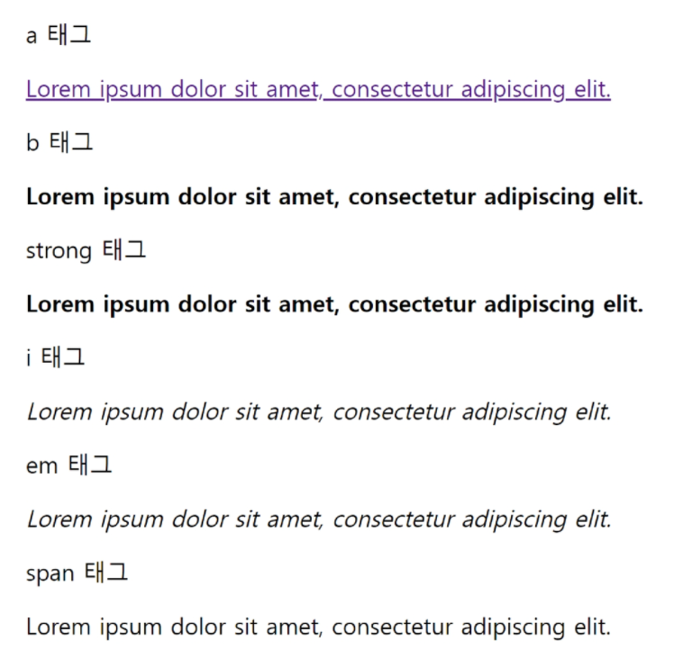
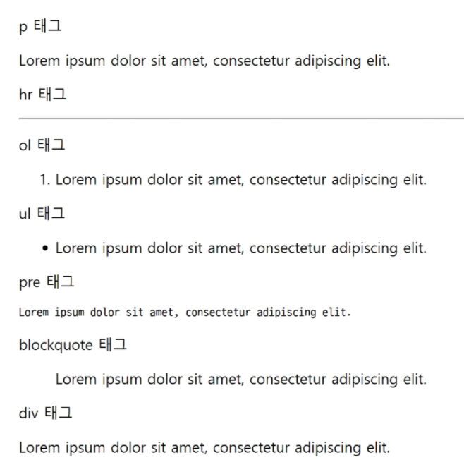
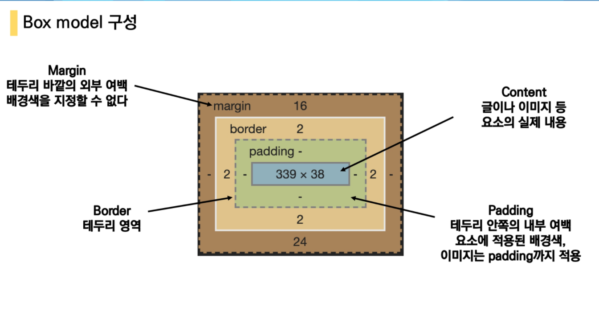

# Web

현재의 웹 표준

W3C (WWW컨소시엄)		WHATWG (Apple, Google, Microsoft, Mozilla 기업들간의 표준)

HTML5								HTML Living Standard => 기술 표준화 

익스플로러는 브라우저가 아니다. 크롬만이 브라우저이다!


단순히 웹 사이트 보는 것이 아닌 디버깅등 개발자 도구를 위해 브라우저를 사용

## HTML (Hyper Text Markup Language)

Hyper Text: 참조를 통해 사용자가 한 문서에서 다른 문서로 즉시 접근할 수 있는 텍스트 

Markup Language: 태크 등을 이용하여 문서나 데이터의 구조를 명시하는 언어

웹페이지 작성을 하기 위한 언어! 

Example

\<h1>HTML\</h1>

<h2\> HyperTest <h2\>

1. 검색기능에 노출되기 위한 수단!
2. 접근성 (찾아가기 쉽다.)

#### HTML 기본구조

* `html`: 문서의 최상위(root) 요소

* `head` : 문서 메타데이터 요소
  * 문서 제목, 인코딩, 스타일, 외부파일 로딩 등
  * 일반적으로 브라우저에 나타나지 않는 내용
  * `<title>` : 브라우저 상단 title
  * `<meta>`
  * 예시 Open Graph Protocol
    * 메타데이터를 표현하는 새로운 규약
    * HTML문서의 메타 데이터를 통해 문서의 정보를 전달
    * 메타정보에 해당하는 제
  * `<link>` : 외부 리소스 연결 요소(CSS, favicon)등
  * `<script>` : 스크립트 요소(javaScript파일/ 코드)
  * `<style>`: CSS 직접 작성
* `body` : 문서 본문 요소
  * 실제 화면 구성과 관련된 내용

#### DOM(Document Object Model)트리

* 텍스트 파일인 HTML문서를 브라우저에서 렌더링 하기 위한 구조
  * HTML 문서에 대한 모델을 구성함


#### 요소(element)

HTML의 요소는 태그와 내용으로 구성되어있다.

* `<h1>contents</h1>`:  <여는 태그> 내용 </닫는 태그> 
  * 어떻게 마크업 할 것인가?

* 태그 : 컨텐츠를 감싸는 것으로 그 정보의 성격과 의미를 정의
* 내용이 없는 태그들
  * `<br/>, hr, img, input, link, meta` : 기능을 하는 친구들 
* 요소는 중첩 될 수 있음
  * 요소의 중첩을 통해 하나의 문서를 구조화
  * 여는 태그와 닫는 태그의 쌍 확인!
  * 오류 발생 X, 레이아웃이 깨진 상태로 출력되기 때문에 디버깅이 힘들어 질 수 있음.

#### 속성(attribute)

* 태그별로 사용할 수 있는 속성은 다르다
* `<a href="http://google.com>구글</a>`
  * 속성 지정시 공백 사용하지 않는다.
* 요소는 속성을 가질 수 있으며, 경로나 크기와 같은 추가적인 정보를 제공
* 요소의 시작태그에 작성하며 보통 이름과 값이 하나의 쌍으로 존재

#### HTML Global Attribute


#### 시맨틱 태그

* HTML5에서 의미론적 요소를 담은 태그의 등장

* 기존 영역을 의미하는 div 태그를 대체하여 사용

  * `<header>, <nav>, <aside>, <section>, <article>, <footer> `
  * 단순히 영역을 나누기 위한 측면

* Non semantic 요소

  * `<div>, <span>`

* 단순히 구역을 나누는 것 뿐만 아니라 '의미'를 가지는 태그들을 활용

* 요소의 의미가 명확해지기 때문에 코드의 가독성을 높이고 

  

### HTML 문서 구조화

#### 텍스트 요소

* `<a></a>`: href 속성을 활용하여 다른 URL로 연결하는 하이퍼링크 생성
* `<b></b>`, `<strong>` : 굵은 글씨 요소, 중요한 강조하고자하는 요소
  * 눈으로 볼 때는 차이 없음
* `<i></i>`, `<em></em>` : 이탤릭체 요소, 중요한 강조하고자 하는 요소
* `<br>` : 텍스트 내에 줄바꿈 생성
* `` : src 속성을 활용하여 이미지 표현
* `<span></span>` : 의미없는 인라인 컨테이너

​	


#### 그룹컨텐츠

* `<p></p>` : 하나의 문단
* `<hr>` : 수평선
* `<ol></ol>`: 순서가 있는 리스트
* `<ul></ul>` : 순서가 없는 리스트
* `<pre></pre>` : HTML에 작성한 내용을 그대로 표현, 보통 고정폭 글꼴이 사용되고 공백문자 유지
* `<blockquote></blockquote>`: 텍스트가 긴 인용문 주로 들여쓰기를 한 것으로 표현됨
* `<div></div>`: 의미 없는 블록 레벨 컨테이너




#### Table

01_table.html 참고


#### form

`<form>`은 정보(데이터)를 서버에 제출하기 위한 영역

* `<form>` 기본 속성
  * action  : form을 처리할 서버의 URL
  * method : form을 제출할 때 사용한 HTTP 메서드 (Get or Post) (요청을 보내는 방법)
    * GET : 오로지 조회만을 위한 요청 (기본값)
    * POST : 어떠한 행위를 한다 (CRUD)
  * enctype : method가 post인 경우 데이터의 유형
    * multipart/form-data : 파일 전송시


#### input

다양한 타입을 가지는 입력 데이터 유형과 위젯이 제공됨

* `<input>` 대표적인 속성
  * name : form control에 적용되는 이름 (이름/값 페어로 전송됨)
  * value : form control에 적용되는 값 (이름/값 페어로 전송됨)
  * `required, readonly, autofocus, autocomplete, disable, placeholder`i

##### input label

* label을 클릭하여 input 자체의 초점을 맞추거나 활성화 시킬 수 있음
  * 사용자는 선택할 수 있는 영역이 늘어나 편리해짐
* `<input>`에 id속성을, `<label>`의 for 속성을 활용하여 상호 연관시킴


##### input유형 - 일반 (type)

* 일반적으로 입력을 받기 위하여 제공되며 타입별로 HTML 기본 검증 혹은 추가 속성 활용 가능
  * text
  * password
  * email
  * number : min, max, step 속성들을 활용하여 범위 지정가능
  * file: accept 속성 활용하여 파일 타입가능
* 항목중 선택
  * 동일 항목에 대하여는 name을 지정하고 선택된 항목에 대한 value를 지정해야함.
  * checkbox : 다중 선택
  * radio : 단일 선택
* 기타
  * 다양한 종류의 input을 위한 picker 제공
    * color, date etc
  * hidden input을 활용하여 사용자 입력을 받지 않고 서버에 전송되어야 하는 값을 설정
    * hidden: 사용자에게 보이지 않는 input

+ mdn


## CSS (Cascading Style Sheets)

CSS는 HTML위에 스타일을 지정하기 위한 언어

* 선택(selector)하고, 스타일을 지정한다.

#### CSS구문 - 용어정리 

```css
선택자
h1 {
    color: blue; 선언;
    font-size: 15px;
}
```

* 선택자를 통해 스타일 지정할 요소 선택
  * 속성: 어떤 스타일 기능을 변경할지 결정
  * 값: 어떻게 변경할지 결정

#### CSS정의 방법

* inline : 태그 내에 `<style>` 속성을 활용하여 지정
* 내부 참조: `<head>` 태그 내에 `<style>`에 지정
* 외부참조: 외부 CSS 파일을 `<head>` 내 `<link>`를 통해 불러오기
  * 하나의 테마와 같은 경우 외부 CSS 파일을 활용하는 것이 좋다

#### CSS with 개발자 도구

* styles: 해당 요소에 선언된 모든 CSS
* computed: 해당 요소에 최종 계산된 CSS


#### 선택자(Selector) 유형

* 기본 선택자

  * 전체 선택자, 요소 선택자 (h1, div 등)
  * 클래스 선택자(여러개의 요소가 공통 속성), 아이디 선택자(단독), 속성 선택자(name)

* 결합자

  * 자손 결합자, 자식 결합자 

    * ```css
      자식 결합자
      <div>
        <ul>
      	==> 자식 태그 
      	css 내에서 div태그 내의 ul 태그에만 속성이 적용 된다.
        </ul>
      </div>
      ```

    * ```css
      자손 결합자
      자식결합자를 포함하여 하위 모든 선택자에 대해 적용
      자식의 자식도 자손
      ```

  * 일반 형제 결합자, 인접 형제 결합자

    * 내 바로 다음 형제 태그만

  * 의사 클래스/ 요소

    * 링크, 동적 의사 클래스

    * 구조적 의사 클래스, 기타 의사클래스, 의사 엘리먼트, 속성 선택자

      

#### CSS 적용 우선순위

1. 중요도 (Importance) - 사용시 주의
   * !important => 다른 것 다 무시하고 최우선적으로 이걸로 사용
   * 주로 디버깅 시 사용, or bootstrap에서 사용
2. 우선 순위 (Specificity)
   * 인라인 > id > class, 속성, pseudo-class > 요소, pseudo-element
3. CSS 파일 로딩 순서


#### CSS 상속

* CSS는 상속을 통해 부모 요소의 속성을 자식에게 상속한다.
  * 속성 중에는 상속이 되는 것과 되지 않는 것들이 있다.
  * 상속 되는 것 예시
    * 예) Text관련 요소(font, color, text-align), opacity, visibility 등
  * 상속 되지 않는 것 예시 (영역과 관련된 것들)
    * Box model 관련요소
    * position 관련요소


### CSS 기본 스타일

#### 크기단위

1. px(픽셀)

   * 모니터 해상도의 한 화소인 '픽셀' 기준

   * 픽셀의 크기는 변하지 않기 때문에 고정적인 단위

2. %

   * 백분율 단위

   * 가변적인 레이아웃에서 자주 사용

3. em

   * 바로 위 부모 요소에 대한 상속의 영향을 받음

   * 배수 단위, 요소에 지정된 사이즈에 상대적인 사이즈를 가짐

4. rem (root em)

   * 상속의 영향을 받지 않음

   * 최상위 요소(html)의 사이즈를 기준으로 배수 단위를 가짐

5. viewport
   * 웹 페이지를 방문한 유저에게 바로 보이게 되는 웹 컨텐츠의 영역(디바이스 화면)
   * 디바이스의 viewport를 기준으로 상대적인 사이즈가 결정됨
   * vw, vh, vmin, vmax

#### 색상 단위

* 색상 키워드
* RGB색상
  * \# + 16진수 표기법
  * rgb() 함수형 표기법
* HSL 색상
  * 색상, 채도, 명도
* a는 alpha(투명도)


#### Selectors 심화

* 결합자

  * 자손 결합자 ( )
    * selectorA 하위의 모든 selectorB요소
  * 자식결합자 (>)
    * selectorA 바로 아래의 selectorB 요소

  * 일반 형제 결합자 (~)
    * selectorA의 형제 요소 중 뒤에 위치하는 selectorB 요소를 모두 선택
  * 인접 형제 결합자 (+)
    * selectorA의 형제 요소 중 바로 뒤에 위치하는 selectorB 요소를 선택


### CSS Box model

#### CSS원칙1

모든 요소는 네모(Box model)이고, 위에서부터 아래로, 왼쪽에서 오른쪽으로 쌓인다.

(좌측 상단에 배치)

* 하나의 박스는 네 부분으로 이루어진다 
  * content : 내용에 들어가는 부분
  * padding : 테두리와 content 사이, 배경색 및 이미지는 padding까지 적용
  * border :  테두리
  * margin : 테두리 바깥의 외부 여백, 배경색 지정 x



* margin
  * top, right, bottom, left 모두 다르게 설정 가능
* padding
  * shorthand를 통해서 표현 가능하다
  * 상부터 시계방향으로 작성
* border
  * width, style, color


#### box-sizing

* 기본적으로 모든 요소의 box-sizing은 content-box
  * Padding을 제외한 순수 contents 영역만을 box로 지정
* box-sizing을 border-box으로 설정


#### CSS Display (표현 방법, block, inline, inline-block)

CSS원칙 II

* 모든 요소는 네모(박스모델)이고, 좌측 상단에 배치.

* display에 따라 크기와 배치가 달라진다.

대표적으로 활용되는 display

* display: block
  * 줄 바꿈이 일어나는 요소
  * 화면 크기 전체의 가로폭을 차지한다.
  * 블록 레벨 요소 안에 인라인 레벨 요소가 들어갈 수 있음
* display: inline
  * 줄 바꿈이 일어나지 않는 행의 일부 요소
  * content 너비만큼 가로폭을 차지한다.
  * width, height, margin-top, margin-bottom을 지정할 수 있다.
  * 상하여백은 line-height로 지정한다.

* 블록 레벨 요소
  * `div / ul / ol / ll / p / hr / form`

* 인라인 레벨 요소

  * `span / a / img / input, label / b, em, i, strong`

* 너비를 가질 수 없다면 마진이 나머지영역 차지한다.

  * 따라서 좌우 정렬이 가능하다.
  * `margin-right: auto; = text-allign:left;`

* display: inline-block

  * block과 inline 레벨 요소의 특징을 모두 가짐
  * inline처럼 한 줄에 표시 가능하고, block처럼 width, height, margin 속성을 모두 지정할 수 있음

* display: none

  * 해당 요소를 화면에 표시하지 않고, 공간 부여조차 되지않음

  * visibility:hidden은 해당 요소가 공간은 차지하나 화면에 표시하지 않음


#### CSS Position

* 문서 상에서 요소의 위치를 지정
* static : 모든 태그의 기본값(기준위치)
  * 일반적인 요소의 배치 순서에 따름(좌측 상단)
  * 부모 요소 내에서 배치될 때는 부모 요소의 위치를 기준으로 배치 됨
* 아래는 좌표 프로퍼티를 사용하여 이동가능
  * `relative, absolute, fixed, sticky`
  * `relative` : 상대 위치  
    * 차지하고 있는 위치는 static 위치를 차지한다.
    * 자신의 static 위치를 기준으로 이동
  * `absolute` : 절대 위치 (요소 위에 요소를 올릴때 주로 사용한다. 썸네일 위 재생버튼 etc)
    * 필요에 따라 사용해야한다.
    * 요소를 일반적인 문서 흐름에서 제거 후 레이아웃에 공간을 차지하지 않음(normal flow에서 벗어남)
    * static이 아닌 가장 가까이 있는 부모/조상 요소를 기준으로 이동
  * `fixed` : 고정위치 
    * 요소를 일반적인 문서 흐름에서 제거 후 레이아웃에 공간을 차지하지 않음(normal flow에서 벗어남)
    * 부모 요소과 관계없이 viewpoint를 기준으로 이동
      * 스크롤 시에도 항상 같은 곳에 위치함

#### CSS원칙

* CSS원칙 I, II : Normal flow
  * 모든 요소는 네모(박스모델), 좌측 상단에 배치
  * display에 따라 크기와 배치가 달라진다
* CSS원칙 III
  * position으로 위치의 기준을 변경 (static: normal flow)
    * relative : 본인의 원래 위치 (원래위치 고수)
    * absolute : 특정 부모의 위치
    * fixed : 화면의 위치


### 마무리

* 웹과 브라우저의 변화, 그리고 표준

* HTML 기본구조
  * 요소, 태그, DOM 트리

* HTML 다양한 태그들

  * 그룹, 텍스트 관련요소

  * `<table>, <form>` 등

* HTML은 보이는 것 이상의 의미를 가지기도 한다.

  * 메타태그, 시맨틱 테그 등을 통한 SEO
  * 웹 접근성


* CSS 기초문법
* CSS 선택자 및 우선순위
* CSS Box model
* CSS Display
* CSS Position


HTML : 웹 페이지가 어떻게 구조화 되어있는지 알 수 있도록 하는 마크업언어

CSS : 사용자에게 문서(HTML)를 표시하는 방법을 지정하는 언어
